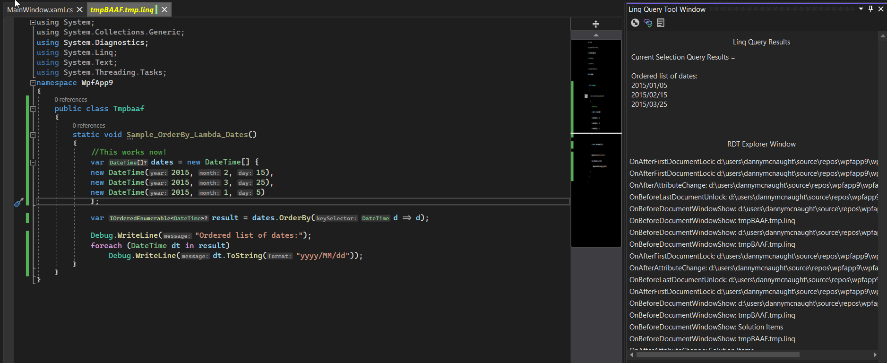

# LinqLanguageEditor2022

<!--Start-Of-TOC-->
   - [My Linq Query Tool Window](#My-Linq-Query-Tool-Window)
   - [LinqPad Dump](#LinqPad-Dump)
   - [Sample results from the following document view method selection](#Sample-results-from-the-following-document-view-method-selection)
   - [Run Selected Query Method](#Run-Selected-Query-Method)
   - [Query Method Results in Toolwindow example](#Query-Method-Results-in-Toolwindow-example)
   - [Query Method Results in LinqPad Dump window example](#Query-Method-Results-in-LinqPad-Dump-window-example)
   - [Sample results from the following document view statement selection](#Sample-results-from-the-following-document-view-statement-selection)
   - [Run Selected Query Statement](#Run-Selected-Query-Statement)
   - [Query Statement Results in Toolwindow example](#Query-Statement-Results-in-Toolwindow-example)
   - [Query Statement Results in LinqPad Dump window example](#Query-Statement-Results-in-LinqPad-Dump-window-example)
   - [LPRun7 Info](#LPRun7-Info)
<!--End-Of-TOC-->


Linq Editor for Visual Studio is a Visual Studio 2022 Extension, that allows developer to run a selected linq query or linq method in the active document, and display those results in a Visual Studio ToolWindow.

>Note: This is not a replacement for [LinqPad](https://www.linqpad.net/), which in my opinon is the best Linq Query builder/tester on the market. I recommend you try LinqPad and then purchase a license for it.

This works by using "LinqPad Launchers for Command-Line Support"! LPRun7-x64.exe runs the query and then returns the script and results of the script to the Visual Studio 2022 Toolwindow called:

## My Linq Query Tool Window 


It also currently creates a Output window called:

## LinqPad Dump


I had to use LPRun7-x64.exe instead of LinqPad.Util.Run found in NuGet packages LinqPad (.net 4.8) and LinqPad.Runtime (.net core 3.0) because even thou I could get the code to run in an .net 4.8 or .net core 6.0 application and returned correct query results, but when using the same code in a Viusal Studio extension, the results returned are always an empty string result for the query.

I do not see this issue when using LPRun7-x64.exe to replace the Nuget package. 

>Note: I will revisit this issue once the [LinqPad](https://www.linqpad.net/) author releases a NuGet package that supports Visual Studio 2022 x64.


The Toolwindow Toolbar button calls the following using process:

`LPRun7-x64.exe -fx=6.0 (selected query to run)   // Run query under .NET 6.0`


 ```csharp
{
   using Process process = new();
    process.StartInfo = new ProcessStartInfo()
    {
        UseShellExecute = false,
        CreateNoWindow = true,
        WindowStyle = ProcessWindowStyle.Hidden,
        FileName = fileLPRun7,
        Arguments = $"{fileLPRun7Args} {tempQueryPath}",
        RedirectStandardError = true,
        RedirectStandardOutput = true
    };
    process.Start();
    queryResult = await process.StandardOutput.ReadToEndAsync();
    process.WaitForExit();
  }
  ```


and returns the query results to the **My Linq Query Tool Window** and **LinqPad Dump** windows.

>Important Note: When running a selected Linq Query Statement you must have the value to be returned assigned to "result". This is becuase, I have not been able to determine from a multi-line statement which result you want returned so which ever statement run will only return the "result". 
>i.e. The following code snippet has a result variable: var result. This is the result and get returned, if this is not named result then you will get an empty return value from the Linq Query Statement.

This example works and returns a result.

```csharp
    List<string> vegetables = new List<string> { "Cucumber", "Tomato", "Broccoli" };

    var result = vegetables.Cast<string>();
```

The above query works and returns:


This example does not work since the `var value` has the value, not a variable called result.

```csharp
    List<string> vegetables = new List<string> { "Cucumber", "Tomato", "Broccoli" };

    var value = vegetables.Cast<string>();
```

The above query does not work returns nothing but the script and an empty result.


>Note: The above statement issue is not a problem for the Method selection since it returns all the `Debug.WriteLine` statements listed in the selected method.


## Sample results from the following document view method selection


## Run Selected Query Method


## Query Method Results in Toolwindow example


## Query Method Results in LinqPad Dump window example


## Sample results from the following document view statement selection


## Run Selected Query Statement


## Query Statement Results in Toolwindow example





## Query Statement Results in LinqPad Dump window example


## LPRun7 Info  

[LPRun7](https://www.linqpad.net/)


> Note: You must have [Community.VisualStudio.Toolkit](https://github.com/VsixCommunity/Community.VisualStudio.Toolkit) installed for your extension project.
