### [Walkthrough: Create Custom Language Editor](#Walkthrough-Create-Custom-Language-Editor)

The walkthrough will show you how to create a Custom Language Editor to Edit and Compile LINQ Queries.

Walkthrough system requirements:

- [Visual Studio 2022](https://visualstudio.microsoft.com/vs/)
- [.Net 6.x](https://dotnet.microsoft.com/en-us/download/dotnet/6.0)
- [VsixCommunity
Community.VisualStudio.Toolkit](https://github.com/VsixCommunity/Community.VisualStudio.Toolkit) installed
- NuGet Packages:
	- Microsoft.CodeAnalysis
	- Microsoft.CodeAnalysis.CSharp
	- Microsoft.CodeAnalysis.CSharp.Scripting
	- Microsoft.CSharp
- Visual Studio 2022 Settings Store

> Note: If you do not want to type alot then you can download the source and just follow along to understand the pieces.
Get the full source solution for this walkthrough from:
[LinqLanguageEditor2022](https://github.com/SFC-Sarge/LinqLanguageEditor2022)


This walkthrough example, when completed, will allow you to select a LINQ query
line or Method in your CSharp Project files, click a button in the `LINQ Query Tool
Window` and the selected LINQ query will be compiled and the results of the LINQ
Query will be displayed in the Custom LINQ Editor Window, opened in either a Preview Tab
or not. Using the following code, you have the option where to display the
temporary LINQ Query. The advantage of using the
`VS.Documents.OpenInPreviewTabAsync` method, is that it is automatically removes
the previous compile LINQ Query Windows tab each time you select and test a LINQ query. Keeping your
Visual Studio document tab space cleaner.


```csharp
if (LinqAdvancedOptions.Instance.OpenInVSPreviewTab == true)
{
	await VS.Documents.OpenInPreviewTabAsync(tempQueryPath);
}
else
{
	await VS.Documents.OpenAsync(tempQueryPath);
}
```


This Language Editor's current features are:

- CSharp Code Syntax Colorzation Support (Note: Our use of .linq files are created as CSharp files and use
	syntax and formatted provide by the CSharp Compiler but have a .linq file extension.)

- Writes and Reads from the Visual Studio 2022 Settings Store

- IntelliSense Support

- ToolWindow Support

	- Toolbar in ToolWindow

		- Toolbar buttons in ToolWindow

		- ToolWindow Messenger Support
		
		- CScripting Support to compile and display LINQ Query Results in ToolWindow 

- Select LINQ Queries and create new temporary tab document, display in
	document in temporary view tab, and return query results in the `LINQ Query
	Tool Window`.

- LINQ language file extension `.linq`

- IVsRunningDocTableEvents document events support

	- OnBeforeDocumentWindowShow (Before `.linq` extension document is
		displayed in tabbed documents view.)

		- OnAfterDocumentWindowHide (When `.linq` extension document is
			removed from tabbed documents view. Note `.Linq` extension documents
			are temporary documents, and are deleted when removed/hidden from
			the Visual Studio Editor.)

-   Code Formatting

-   Tools Options and Settings Support

## [Creating a Visual Studio 2022 CSharp Extension Project](#Create-Visual-Studio-2022-CSharp-Extension)

### [Getting Started](#Getting-Started):

In Visual Studio 2022 install: (If you don’t’ already have it.) [VsixCommunity
Community.VisualStudio.Toolkit](https://github.com/VsixCommunity/Community.VisualStudio.Toolkit)
then create a new Visual Studio 2022 CSharp Extension using the:
`VSIX Project w/Tool Window (Community) Project Template`


Create New project in Visual Studio 2022


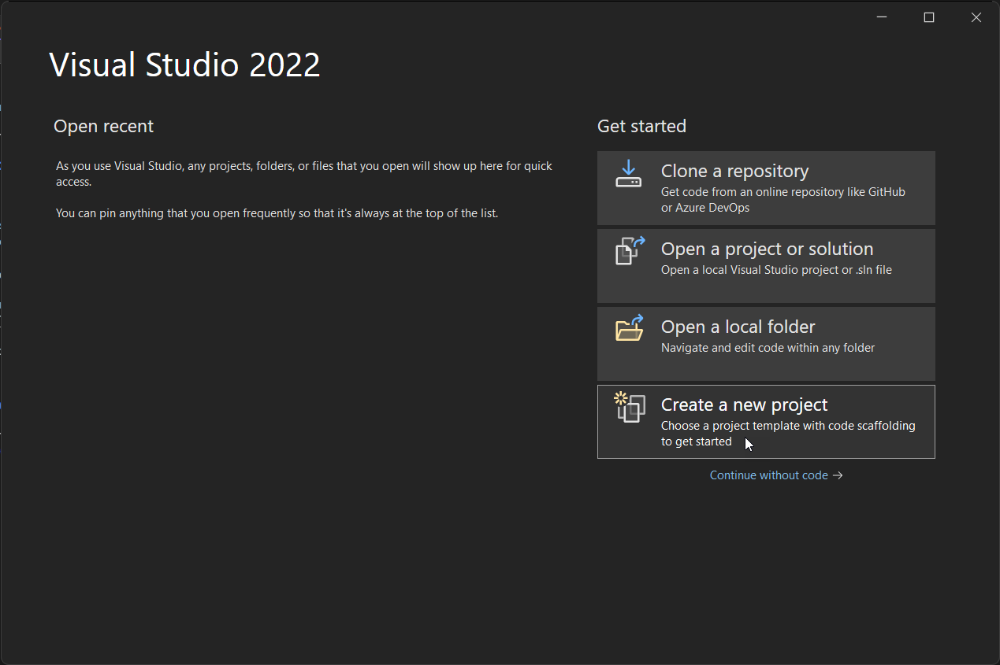


Select the `VSIX Project w/Tool Window (Community) Project Template`


Name the new extension project LinqLanguageEditor2022

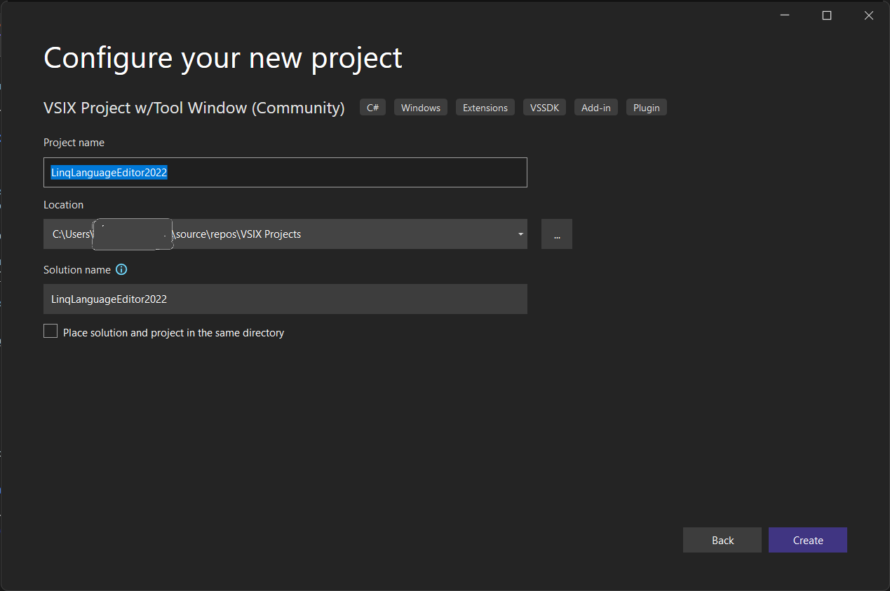

Solution Explore should look like this now:

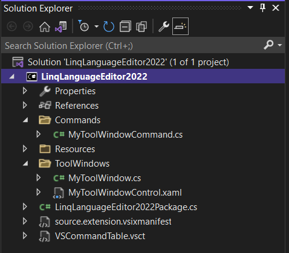

Add NuGet Packages:

- Microsoft.CodeAnalysis
- Microsoft.CodeAnalysis.CSharp
- Microsoft.CodeAnalysys.CSharp.Scripting
- Microsoft.CSharp


Now would be a good time if you do not already have it installed.  [Add New File (64-bit)](https://marketplace.visualstudio.com/items?itemName=MadsKristensen.AddNewFile64) extension from the Visual Studio Marketplace


Once the [Add New File (64-bit)](https://marketplace.visualstudio.com/items?itemName=MadsKristensen.AddNewFile64) extension is installed.

Right-click on the project and click: Add then: New Empty File...


Add a new CSharp file to the project, name it Constants.cs:


In the Constants.cs file change the class visibility from public to internal and add the following constants.

```csharp
	internal class Constants
	{
		//Lanaguage Names
		public const string LinqLanguageName = "Linq";
		public const string LinqExt = ".linq";
		public const string LinqBaselanguageName = "CSharp";
		public const string LinqTmpExt = ".tmp";

		//ComboBox Text Color Message:
		public const string RunningSelectQueryMsgColor = "Running Select Query Method Message Color";
		public const string ResultsCodeTextColor = "Select LINQ Results Code Color";
		public const string QueryEqualsMsgColor = "Selected LINQ Query Results Equal Message Color.";
		public const string ResultColor = "Select LINQ Results Text Color";
		public const string ExceptionAdditionMsgColor = "Select LINQ Results Error Text Color";

		//ToolWindow Messages
		public const string AdvanceOptionText = "LINQ Language Editor Advanced Option Settings";
		public const string NoActiveDocument = "No Active Document View or LINQ Query Selection!\r\nPlease Select LINQ Query Statement or Method in Active Document,\r\nthen try again!";
		public const string RunningSelectQuery = "Running Selected LINQ Query.\r\nPlease Wait!";
		public const string CurrentSelectionQueryMethod = "Current Selection Query Method Results";
		public const string RunningSelectQueryMethod = "Running Selected LINQ Query Method.\r\n\r\nPlease Wait!";
		public const string ExceptionAdditionMessage = "Try Selecting the complete LINQ Query code line or the entire LINQ Query Method code block!";
		public const string RunSelectedLinqMethod = "Run Selected LINQ Query Statement or Method.";
		public const string CurrentLinqMethodSupport = "Selected LINQ Query is not supported yet!";
		public const string SelectResultVariableNotFound = "Result Variable for LINQ Query not found!";
		public const string CompilaitonFailure = "LINQ Query Compilation Failure!";
		public const string LinqQueryEquals = "Current Selected LINQ Query Results: =";

		//ToolWindow Names
		public const string LinqEditorToolWindowTitle = "LINQ Query Tool Window";
		public const string SolutionToolWindowsFolderName = "ToolWindows";
		public const string LinqAdvancedOptionPage = "Advanced";
		public const string LinqQueryTextHeader = "Selected LINQ Query:";
		public const string PaneGuid = "A938BB26-03F8-4861-B920-6792A7D4F07C";

		//Package Class
		public const string ProvideFileIcon = "KnownMonikers.RegistrationScript";
		public const string ProvideMenuResource = "Menus.ctmenu";

		//LINQ Templates
		public const string LinqStatementTemplate = "using System;\r\nusing System.Collections.Generic;\r\nusing System.Diagnostics;\r\nusing System.Linq;\r\nusing System.Text;\r\nusing System.Threading.Tasks;\r\nnamespace {namespace}\r\n{\r\n\tpublic class {itemname}\r\n\t{\r\n\t\tpublic static void {methodname}()\r\n\t\t{\r\n\t\t\t{$}\r\n\t\t}\r\n\t}\r\n}";
		public const string LinqMethodTemplate = "using System;\r\nusing System.Collections.Generic;\r\nusing System.Diagnostics;\r\nusing System.Linq;\r\nusing System.Text;\r\nusing System.Threading.Tasks;\r\nnamespace {namespace}\r\n{\r\n\tpublic class {itemname}\r\n\t{\r\n\t\t{$}\r\n\t}\r\n}";
		public const string VoidMain = "void Main()";

		//Default LINQ Result Variable Name:
		public const string LinqResultText = "result";
		public const string LinqResultMessageText = "Select LINQ Results Variable to Return";
		public const string LinqResultVarMessageText = "was not found!\r\nWould you like to Select a different LINQ Query return variable from the Selected LINQ Query?";

		//Where to Open Editor
		public const string LinqEditorOpenPreviewTabMessage = "Open Linq Query and result in Visual Studio Preview Tab";

		//Enable Toolwindow for results
		public const string LinqEditorResultsInToolWindow = "Enable Tool Window for Linq Query and results";

		//Default CheckBox Settings:
		public const bool EnableToolWindowResults = true;
		public const bool OpenInVSPreviewTab = true;

		//Default Colors:
		public const string LinqRunningSelectQueryMsgColor = "LightBlue";
		public const string LinqCodeResultsColor = "LightGreen";
		public const string LinqResultsEqualMsgColor = "LightBlue";
		public const string LinqResultsColor = "Yellow";
		public const string LinqExceptionAdditionMsgColor = "Red";

		//CScriptImports
		public const string SystemImport = "System";
		public const string SystemLinqImport = $"{SystemImport}.Linq";
		public const string SystemCollectionsImport = $"{SystemImport}.Collections";
		public const string SystemCollectionsGenericImports = $"{SystemCollectionsImport}.Generic";
		public const string SystemDiagnosticsImports = $"{SystemImport}.Diagnostics";

		//Options Settings:
		public const string OptionCategoryResults = "Results";
		public const string LinqAdvancedOptionPageGuid = "05F5CC22-0DF4-4D38-9B25-F54AAF567201";

		//LinqLanguageEditorProjectFileSettings
		public const string ProjectItemGroup = "ItemGroup";
		public const string ProjectCompile = "Compile";
		public const string ProjectInclude = "Include";
		public const string ProjectNone = "None";

		//MsgDialog Settings:
		public const string ResultVarChangeMsg = "The current default LINQ result variable does not exist in this selected LINQ Query!\r\n\r\nPlease select a LINQ result variable that exists in the selected LINQ Query from the list below.\r\n\r\nThen click the [OK] button to run the selected LINQ Query again.";
		public const string RadioButtonName = "radio";
	}
```

## [ToolWindow Features](#ToolWindow-Features)

In Solution Explorer open the ToolWindows\MyToolWindow.cs file.

Right-Click on the Class name `MyToolWindow` then click Rename

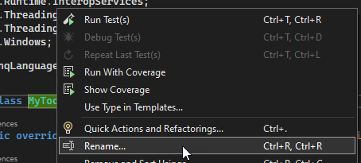

Rename it to `LinqToolWindow` and make sure you check:

- Include comments
- Include strings
- Rename symbol's file
- Preview changes

Click Apply:


Then Click Apply in `Preview Changes-Rename`:


In Solution Explorer Right-Click `MyToolWindowControl.xaml` file and click Rename:

Rename the file to `LinqToolWindowControl.xaml` and hit enter key.

In Solution Explorer Right-Click `MyToolWindowCommand.cs` file and click Rename:
Rename the file to `LinqToolWindowCommand.cs` and hit enter key.

Click Yes to the pop-up Dialog:


Solution Explorer should now look like this:

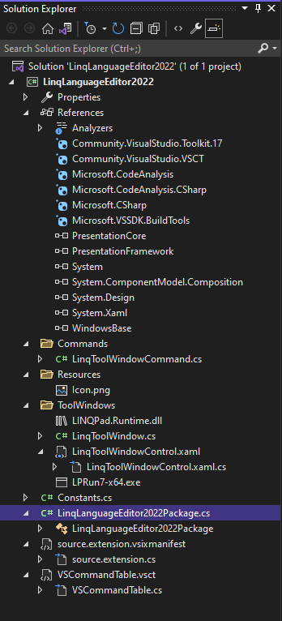

At this point the project will build without issues.


## [Update Package file](#Update-Package-file)

Open the package file `LinqLanguageEditor2022Package.cs`.

Add `ProvideToolWindowVisibility` attribute lines under the `ProvideToolWindow` attribute:

```CSharp
[ProvideToolWindowVisibility(typeof(LinqToolWindow.Pane), VSConstants.UICONTEXT.SolutionHasSingleProject_string)]
[ProvideToolWindowVisibility(typeof(LinqToolWindow.Pane), VSConstants.UICONTEXT.SolutionHasMultipleProjects_string)]
[ProvideToolWindowVisibility(typeof(LinqToolWindow.Pane), VSConstants.UICONTEXT.NoSolution_string)]
[ProvideToolWindowVisibility(typeof(LinqToolWindow.Pane), VSConstants.UICONTEXT.EmptySolution_string)]
```

So now the Package file attributes should look like this:

```CSharp
[PackageRegistration(UseManagedResourcesOnly = true, AllowsBackgroundLoading = true)]
[InstalledProductRegistration(Vsix.Name, Vsix.Description, Vsix.Version)]
[ProvideToolWindow(typeof(LinqToolWindow.Pane), Style = VsDockStyle.Tabbed, Window = WindowGuids.SolutionExplorer)]
[ProvideToolWindowVisibility(typeof(LinqToolWindow.Pane), VSConstants.UICONTEXT.SolutionHasSingleProject_string)]
[ProvideToolWindowVisibility(typeof(LinqToolWindow.Pane), VSConstants.UICONTEXT.SolutionHasMultipleProjects_string)]
[ProvideToolWindowVisibility(typeof(LinqToolWindow.Pane), VSConstants.UICONTEXT.NoSolution_string)]
[ProvideToolWindowVisibility(typeof(LinqToolWindow.Pane), VSConstants.UICONTEXT.EmptySolution_string)]
[ProvideMenuResource("Menus.ctmenu", 1)]
[Guid(PackageGuids.LinqLanguageEditor2022String)]
```

Add a `ProvideFileIcon` attribute after the last ProvideToolWindowVisibility attribute:

```CSharp
[ProvideFileIcon(Constants.LinqExt, Constants.ProvideFileIcon)]
```

We now have the File Icon set to our `Constants.LinqExt` (.linq) and an Icon image using the `KnownMonikers.RegistrationScript`

Change the line from this:

```CSharp
[ProvideMenuResource("Menus.ctmenu", 1)]
```

To this:

```CSharp
[ProvideMenuResource(Constants.ProvideMenuResource, 1)]
```


At this point the project should still build without issues.


## [Create a LINQ Editor Factory](#Create-LINQ-Editor-Factory)

In Solution Explorer right-click the project and click `Add` then `New Empty File...`

In the Add New File (64-bit) dialog enter `LinqEditor\LinqLanguageFactory.cs` then click `Add file`.


In Solution Explorer open `VSCommandTable.vsct` file: (Note: This is an xml file.)

In the `<Symbols>` section above the first `<GuidSymbol>` section add the line below then update to Guid `{0CA07535-1A01-485D-9E65-59B7384A593C}` to a new Guid value.

```xml
<GuidSymbol name="LinqEditorFactory" value="{0CA07535-1A01-485D-9E65-59B7384A593C}" />
```

So from this:

```xml
<Symbols>
<GuidSymbol name="LinqLanguageEditor2022" value="{fbcd0cc8-7332-4a38-ad18-4d271e337600}">
	<IDSymbol name="MyCommand" value="0x0100" />
</GuidSymbol>
</Symbols>
```

To this:

```xml
<Symbols>
	<GuidSymbol name="LinqEditorFactory" value="{0CA07535-1A01-485D-9E65-59B7384A593C}" />
	<GuidSymbol name="LinqLanguageEditor2022" value="{fbcd0cc8-7332-4a38-ad18-4d271e337600}">
	<IDSymbol name="MyCommand" value="0x0100" />
</GuidSymbol>
</Symbols>
```

Now rename the `MyCommand` name in two places iside of `VSCommandTable.vsct` file.

Rename `MyCommand` to `LinqToolWindowCommand`.

Rename `<ButtonText>My Tool Window</ButtonText>` to `<ButtonText>LINQ Query Tool Window</ButtonText>`

Save the `VSCommandTable.vsct` file.

Now when we build we get our first build error:

> Error	CS0117	'PackageIds' does not contain a definition for 'MyCommand'	LinqLanguageEditor2022

To fix this double click the error in the Error List window. It will open LinqToolWindowCommand.cs file.

Rename `[Command(PackageIds.MyCommand)]` to `[Command(PackageIds.LinqToolWindowCommand)]` and save the file.

Should build without issues now.

## [Add Toolbar and Button to ToolWindow](#Add-Toolbar-and-Buttons-to-ToolWindow)

In the `VSCommandTable.vsct` file under the `<Symbols>` section Add below the `LinqCommand` line:

```xml
<IDSymbol name="LinqTWindowToolbar" value="0x1000" />
<IDSymbol name="LinqTWindowToolbarGroup" value="0x1050" />
```

It should look like this now:

```xml
<Symbols>
	<GuidSymbol name="LinqEditorFactory" value="{0CA07535-1A01-485D-9E65-59B7384A593C}" />
	<GuidSymbol name="LinqLanguageEditor2022" value="{fbcd0cc8-7332-4a38-ad18-4d271e337600}">
		<IDSymbol name="LinqToolWindowCommand" value="0x0100" />
		<IDSymbol name="LinqTWindowToolbar" value="0x1000" />
		<IDSymbol name="LinqTWindowToolbarGroup" value="0x1050" />
	</GuidSymbol>
</Symbols>
```

Now add the `ToolWindowToolbar` `<Menus>` to the `VSCommandTable.vsct` file, inside of the `<Commands package` section and above the `<Buttons>` section:

```xml
<Commands package="LinqLanguageEditor2022">
	<!--This section defines the elements the user can interact with, like a menu command or a button or combo box in a toolbar. -->
	<Menus>
		<Menu guid="LinqLanguageEditor2022" id="LinqTWindowToolbar" type="ToolWindowToolbar">
			<CommandFlag>DefaultDocked</CommandFlag>
			<Strings>
				<ButtonText>Tool Window Toolbar</ButtonText>
			</Strings>
		</Menu>
	</Menus>
```

Now add the `LinqEditorGroup` and `LinqTWindowToolbar` groups to file just below the `</Menus>` element your just added:

```xml
<Groups>
	<Group guid="LinqLanguageEditor2022" id="LinqEditorGroup" priority="9000">
		<Parent guid="guidSHLMainMenu" id ="IDM_VS_CTXT_CODEWIN"/>
	</Group>
	<Group guid="LinqLanguageEditor2022" id="LinqTWindowToolbarGroup" priority="0x0000">
		<Parent guid="LinqLanguageEditor2022" id="LinqTWindowToolbar" />
	</Group>
</Groups>
```


Open the package file `LinqLanguageEditor2022Package.cs`.

Add a using statement:

```CSharp
using LinqLanguageEditor2022.LinqEditor;
```

Add the `ProvideLanguageService` attribute line:

```CSharp
[ProvideLanguageService(typeof(LinqLanguageFactory), Constants.LinqLanguageName, 0, ShowHotURLs = false, DefaultToNonHotURLs = true, EnableLineNumbers = true, EnableAsyncCompletion = true, EnableCommenting = true, ShowCompletion = true, AutoOutlining = true, CodeSense = true)]
```

Should look like this now:

```CSharp
[PackageRegistration(UseManagedResourcesOnly = true, AllowsBackgroundLoading = true)]
[InstalledProductRegistration(Vsix.Name, Vsix.Description, Vsix.Version)]
[ProvideToolWindow(typeof(LinqToolWindow.Pane), Style = VsDockStyle.Tabbed, Window = WindowGuids.SolutionExplorer)]
[ProvideToolWindowVisibility(typeof(LinqToolWindow.Pane), VSConstants.UICONTEXT.SolutionHasSingleProject_string)]
[ProvideToolWindowVisibility(typeof(LinqToolWindow.Pane), VSConstants.UICONTEXT.SolutionHasMultipleProjects_string)]
[ProvideToolWindowVisibility(typeof(LinqToolWindow.Pane), VSConstants.UICONTEXT.NoSolution_string)]
[ProvideToolWindowVisibility(typeof(LinqToolWindow.Pane), VSConstants.UICONTEXT.EmptySolution_string)]
[ProvideFileIcon(Constants.LinqExt, Constants.ProvideFileIcon)]
[ProvideMenuResource(Constants.ProvideMenuResource, 1)]
[Guid(PackageGuids.LinqLanguageEditor2022String)]

[ProvideLanguageService(typeof(LinqLanguageFactory), Constants.LinqLanguageName, 0, ShowHotURLs = false, DefaultToNonHotURLs = true, EnableLineNumbers = true, EnableAsyncCompletion = true, EnableCommenting = true, ShowCompletion = true, AutoOutlining = true, CodeSense = true)]
```


Edit the `LinqLanguageFactory.cs` class and change the class visibility to internal and add the following code:

Add using statment:

```CSharp
using System.ComponentModel.Composition;
```

Update Class code to:

```CSharp
[ComVisible(true)]
[Guid(PackageGuids.LinqEditorFactoryString)]
internal sealed class LinqLanguageFactory : LanguageBase
{
	[Export]
	[Name(Constants.LinqLanguageName)]
	[BaseDefinition("code")]
	[BaseDefinition("Intellisense")]
	[BaseDefinition(Constants.LinqBaselanguageName)]
	internal static ContentTypeDefinition LinqContentTypeDefinition { get; set; }

	[Import]
	internal IEditorOptionsFactoryService EditorOptions { get; set; }

	[Export]
	[FileExtension(Constants.LinqExt)]
	[ContentType(Constants.LinqLanguageName)]
	[BaseDefinition("code")]
	[BaseDefinition("Intellisense")]
	[BaseDefinition(Constants.LinqBaselanguageName)]
	internal static FileExtensionToContentTypeDefinition LinqFileExtensionDefinition { get; set; }

	[Export]
	[Name(Constants.LinqLanguageName)]
	[BaseDefinition(Constants.LinqBaselanguageName)]
	internal static ClassificationTypeDefinition LinqDefinition { get; set; }

	public LinqLanguageFactory(object site) : base(site)
	{ }

	public override string Name => Constants.LinqLanguageName;

	public override string[] FileExtensions { get; } = new[] { Constants.LinqExt };


	public override void SetDefaultPreferences(LanguagePreferences preferences)
	{
		preferences.EnableCodeSense = true;
		preferences.EnableMatchBraces = true;
		preferences.EnableMatchBracesAtCaret = true;
		preferences.EnableShowMatchingBrace = true;
		preferences.EnableCommenting = true;
		preferences.HighlightMatchingBraceFlags = _HighlightMatchingBraceFlags.HMB_USERECTANGLEBRACES;
		preferences.LineNumbers = true;
		preferences.MaxErrorMessages = 100;
		preferences.AutoOutlining = true;
		preferences.MaxRegionTime = 2000;
		preferences.InsertTabs = true;
		preferences.IndentSize = 2;
		preferences.IndentStyle = IndentingStyle.Smart;
		preferences.ShowNavigationBar = true;
		preferences.EnableFormatSelection = true;

		preferences.WordWrap = true;
		preferences.WordWrapGlyphs = true;

		preferences.AutoListMembers = true;
		preferences.HideAdvancedMembers = false;
		preferences.EnableQuickInfo = true;
		preferences.ParameterInformation = true;
	}

	public override void Dispose()
	{
		base.Dispose();
	}
}
```

## [Register the Language Factory](#Register-the-Language-Factory)

In the `LinqLanguageEditor2022Package.cs` file, under the Task InitializeAsync method of the LinqLanguageEditor2022Package Class, Register the Language Factory by add this code:

```CSharp
LinqLanguageFactory LinqLanguageEditor2022 = new(this);
RegisterEditorFactory(LinqLanguageEditor2022);
```

The LinqlanguageEditor2022Package Class should look like this now:

```CSharp
public sealed class LinqLanguageEditor2022Package : ToolkitPackage
{
	protected override async Task InitializeAsync(CancellationToken cancellationToken, IProgress<ServiceProgressData> progress)
	{
		LinqLanguageFactory LinqLanguageEditor2022 = new(this);
		RegisterEditorFactory(LinqLanguageEditor2022);
		await this.RegisterCommandsAsync();

		this.RegisterToolWindows();
	}
}
```

Lets add support for the Visual Studio Settings Store.

Right click on the projects `Options` folder and click `add` then `Add New Item` then select `WPF` and on the right side select `User Control (WPF).

Give the file the name `AdvancedOptions.xaml` then click `Add`.


Open the `AdvancedOptions.xaml` file in the WPF Designer;

Update the file contents to:

```XML
<UserControl
	x:Class="LinqLanguageEditor2022.Options.AdvancedOptions"
	xmlns="http://schemas.microsoft.com/winfx/2006/xaml/presentation"
	xmlns:x="http://schemas.microsoft.com/winfx/2006/xaml"
	xmlns:d="http://schemas.microsoft.com/expression/blend/2008"
	xmlns:local="clr-namespace:LinqLanguageEditor2022.Options"
	xmlns:mc="http://schemas.openxmlformats.org/markup-compatibility/2006"
	mc:Ignorable="d"
	d:DesignHeight="450"
	d:DesignWidth="800">
	<Grid>
		<Grid.ColumnDefinitions>
			<ColumnDefinition Width="*" />
		</Grid.ColumnDefinitions>
		<ScrollViewer Grid.Column="0" HorizontalScrollBarVisibility="Auto">
			<StackPanel Margin="20, 20" Orientation="Vertical">
				<TextBlock Margin="0,5"
					x:Name="LinqResultsText" Text="Select LINQ Results Variable to Return"
					HorizontalAlignment="Left"
					VerticalAlignment="Top"
					TextWrapping="Wrap" />
				<TextBox Margin="0,5" Width="250"
						 Text="result"
					x:Name="linqResultVariableText"
					HorizontalAlignment="Left" HorizontalContentAlignment="Right"
					VerticalAlignment="Top"
					TextWrapping="Wrap" SelectionChanged="linqResultVariableText_SelectionChanged" TextChanged="linqResultVariableText_TextChanged" />
				<TextBlock Margin="0,5"
					x:Name="advanceOptionText"
					HorizontalAlignment="Left"
					VerticalAlignment="Top"
					TextWrapping="Wrap" />
				<CheckBox Margin="0,5"
					x:Name="cbOpenInVSPreviewTab"
					HorizontalAlignment="Left"
					VerticalAlignment="Top"
					Checked="cbOpenInVSPreviewTab_Checked"
					Content="Open Linq Query and result in Visual Studio Preview Tab"
					IsThreeState="False"
					Unchecked="cbOpenInVSPreviewTab_Unchecked" />
				<CheckBox Margin="0,5"
					x:Name="cbEnableToolWindowResults"
					HorizontalAlignment="Left"
					VerticalAlignment="Top"
					Checked="cbEnableToolWindowResults_Checked"
					Content="Enable Tool Window for Linq Query and results"
					IsThreeState="False"
					Unchecked="cbEnableToolWindowResults_Unchecked" />
				<TextBlock Margin="0,5"
					x:Name="tbResultCodeColor"
					HorizontalAlignment="Left"
					VerticalAlignment="Top"
					TextWrapping="Wrap" />
				<ComboBox Name="cmbResultCodeColor" Margin="0,5"
						  SelectionChanged="cmbResultCodeColor_SelectionChanged"
						  Height="30" Width="250" HorizontalAlignment="Left" >
					<ComboBox.ItemTemplate>
						<DataTemplate>
							<StackPanel Orientation="Horizontal">
								<Rectangle Fill="{Binding Name}" Width="16" Height="16" Margin="0,2,5,2" />
								<TextBlock Text="{Binding Name}" />
							</StackPanel>
						</DataTemplate>
					</ComboBox.ItemTemplate>
				</ComboBox>
				<TextBlock Margin="0,5"
					x:Name="tbResultColor"
					HorizontalAlignment="Left"
					VerticalAlignment="Top"
					TextWrapping="Wrap" />
				<ComboBox Name="cmbResultColor" Margin="0,5"
						  SelectionChanged="cmbResultColor_SelectionChanged"
						  Height="30" Width="250" HorizontalAlignment="Left" >
					<ComboBox.ItemTemplate>
						<DataTemplate >
							<StackPanel Orientation="Horizontal">
								<Rectangle Fill="{Binding Name}" Width="16" Height="16" Margin="0,2,5,2" />
								<TextBlock Text="{Binding Name}" />
							</StackPanel>
						</DataTemplate>
					</ComboBox.ItemTemplate>
				</ComboBox>
				<TextBlock Margin="0,5"
					x:Name="tbRunningQueryMsgColor"
					HorizontalAlignment="Left"
					VerticalAlignment="Top"
					TextWrapping="Wrap" />
				<ComboBox Name="cmbRunningQueryMsgColor" Margin="0,5"
						  SelectionChanged="cmbRunningQueryMsgColor_SelectionChanged"
						  Height="30" Width="250" HorizontalAlignment="Left">
					<ComboBox.ItemTemplate>
						<DataTemplate>
							<StackPanel Orientation="Horizontal">
								<Rectangle Fill="{Binding Name}" Width="16" Height="16" Margin="0,2,5,2" />
								<TextBlock Text="{Binding Name}" />
							</StackPanel>
						</DataTemplate>
					</ComboBox.ItemTemplate>
				</ComboBox>
				<TextBlock Margin="0,5"
					x:Name="tbResultsEqualMsgColor"
					HorizontalAlignment="Left"
					VerticalAlignment="Top"
					TextWrapping="Wrap" />
				<ComboBox Name="cmbResultsEqualMsgColor" Margin="0,5"
						  SelectionChanged="cmbResultsEqualMsgColor_SelectionChanged"
						  Height="30" Width="250" HorizontalAlignment="Left">
					<ComboBox.ItemTemplate>
						<DataTemplate>
							<StackPanel Orientation="Horizontal">
								<Rectangle Fill="{Binding Name}" Width="16" Height="16" Margin="0,2,5,2" />
								<TextBlock Text="{Binding Name}" />
							</StackPanel>
						</DataTemplate>
					</ComboBox.ItemTemplate>
				</ComboBox>
				<TextBlock Margin="0,5"
					x:Name="tbExceptionAdditionMsgColor"
					HorizontalAlignment="Left"
					VerticalAlignment="Top"
					TextWrapping="Wrap" />
				<ComboBox Name="cmbExceptionAdditionMsgColor" Margin="0,5"
						  SelectionChanged="cmbExceptionAdditionMsgColor_SelectionChanged"
						  Height="30" Width="250" HorizontalAlignment="Left">
					<ComboBox.ItemTemplate>
						<DataTemplate>
							<StackPanel Orientation="Horizontal">
								<Rectangle Fill="{Binding Name}" Width="16" Height="16" Margin="0,2,5,2" />
								<TextBlock Text="{Binding Name}" />
							</StackPanel>
						</DataTemplate>
					</ComboBox.ItemTemplate>
				</ComboBox>
			</StackPanel>
		</ScrollViewer>

	</Grid>
</UserControl>
```

Now open the code behind file: `AdvancedOptions.xaml.cs` and update it's contents.

```CSharp
using System.ComponentModel;
using System.Reflection;
using System.Windows.Controls;
using System.Windows.Media;

using LinqLanguageEditor2022.Extensions;

namespace LinqLanguageEditor2022.Options
{
	/// <summary>
	/// Interaction logic for AdvancedOptions.xaml
	/// </summary>
	public partial class AdvancedOptions : UserControl
	{
		public AdvancedOptions()
		{
			InitializeComponent();
		}
		internal LinqAdvancedOptionPage advancedOptionsPage;

		public void Initialize()
		{
			cmbResultCodeColor.ItemsSource = typeof(Brushes).GetProperties();
			cmbResultColor.ItemsSource = typeof(Brushes).GetProperties();
			cmbRunningQueryMsgColor.ItemsSource = typeof(Brushes).GetProperties();
			cmbExceptionAdditionMsgColor.ItemsSource = typeof(Brushes).GetProperties();
			cmbResultsEqualMsgColor.ItemsSource = typeof(Brushes).GetProperties();
			LinqResultsText.Text = Constants.LinqResultMessageText;
			advanceOptionText.Text = Constants.AdvanceOptionText;
			tbResultCodeColor.Text = Constants.ResultsCodeTextColor;
			tbResultColor.Text = Constants.ResultColor;
			tbResultsEqualMsgColor.Text = Constants.QueryEqualsMsgColor;
			tbRunningQueryMsgColor.Text = Constants.RunningSelectQueryMsgColor;
			tbExceptionAdditionMsgColor.Text = Constants.ExceptionAdditionMsgColor;
			tbExceptionAdditionMsgColor.Text = Constants.ExceptionAdditionMsgColor;
			ThreadHelper.JoinableTaskFactory.RunAsync(async () =>
			{
				await ThreadHelper.JoinableTaskFactory.SwitchToMainThreadAsync();
				//Update Values in the Settings Store.
				LinqAdvancedOptions linqAdvancedOptions = await LinqAdvancedOptions.GetLiveInstanceAsync();
				await linqAdvancedOptions.LoadAsync();
				cbOpenInVSPreviewTab.IsChecked = linqAdvancedOptions.OpenInVSPreviewTab;
				cbEnableToolWindowResults.IsChecked = linqAdvancedOptions.EnableToolWindowResults;
				cmbResultCodeColor.SelectedIndex = LinqEnumExtensions.EnumIndexFromString<ResultsColorOptions>(linqAdvancedOptions.LinqCodeResultsColor);
				cmbResultColor.SelectedIndex = LinqEnumExtensions.EnumIndexFromString<ResultsColorOptions>(linqAdvancedOptions.LinqResultsColor);
				cmbResultsEqualMsgColor.SelectedIndex = LinqEnumExtensions.EnumIndexFromString<ResultsColorOptions>(linqAdvancedOptions.LinqResultsEqualMsgColor);
				cmbRunningQueryMsgColor.SelectedIndex = LinqEnumExtensions.EnumIndexFromString<ResultsColorOptions>(linqAdvancedOptions.LinqRunningSelectQueryMsgColor);
				cmbExceptionAdditionMsgColor.SelectedIndex = LinqEnumExtensions.EnumIndexFromString<ResultsColorOptions>(linqAdvancedOptions.LinqExceptionAdditionMsgColor);
				LinqAdvancedOptions.Instance.LinqResultText = linqAdvancedOptions.LinqResultText;
				LinqAdvancedOptions.Instance.OpenInVSPreviewTab = linqAdvancedOptions.OpenInVSPreviewTab;
				LinqAdvancedOptions.Instance.EnableToolWindowResults = linqAdvancedOptions.EnableToolWindowResults;
				LinqAdvancedOptions.Instance.LinqCodeResultsColor = linqAdvancedOptions.LinqCodeResultsColor;
				LinqAdvancedOptions.Instance.LinqResultsColor = linqAdvancedOptions.LinqResultsColor;
				LinqAdvancedOptions.Instance.LinqResultsEqualMsgColor = linqAdvancedOptions.LinqResultsEqualMsgColor;
				LinqAdvancedOptions.Instance.LinqRunningSelectQueryMsgColor = linqAdvancedOptions.LinqRunningSelectQueryMsgColor;
				LinqAdvancedOptions.Instance.LinqExceptionAdditionMsgColor = linqAdvancedOptions.LinqExceptionAdditionMsgColor;
				await LinqAdvancedOptions.Instance.SaveAsync();
			}).FireAndForget();
		}

		private void cbOpenInVSPreviewTab_Checked(object sender, System.Windows.RoutedEventArgs e)
		{
			ThreadHelper.JoinableTaskFactory.RunAsync(async () =>
			{
				await ThreadHelper.JoinableTaskFactory.SwitchToMainThreadAsync();
				LinqAdvancedOptions.Instance.OpenInVSPreviewTab = (bool)cbOpenInVSPreviewTab.IsChecked;
				await LinqAdvancedOptions.Instance.SaveAsync();
				//Update Values in the Settings Store.
				LinqAdvancedOptions linqAdvancedOptions = await LinqAdvancedOptions.GetLiveInstanceAsync();
				linqAdvancedOptions.OpenInVSPreviewTab = (bool)cbOpenInVSPreviewTab.IsChecked;
				await linqAdvancedOptions.SaveAsync();
			}).FireAndForget();
		}

		private void cbEnableToolWindowResults_Checked(object sender, System.Windows.RoutedEventArgs e)
		{
			ThreadHelper.JoinableTaskFactory.RunAsync(async () =>
			{
				await ThreadHelper.JoinableTaskFactory.SwitchToMainThreadAsync();
				LinqAdvancedOptions.Instance.EnableToolWindowResults = (bool)cbEnableToolWindowResults.IsChecked;
				await LinqAdvancedOptions.Instance.SaveAsync();
				//Update Values in the Settings Store.
				LinqAdvancedOptions linqAdvancedOptions = await LinqAdvancedOptions.GetLiveInstanceAsync();
				linqAdvancedOptions.EnableToolWindowResults = (bool)cbEnableToolWindowResults.IsChecked;
				await linqAdvancedOptions.SaveAsync();
			}).FireAndForget();
		}

		private void cbOpenInVSPreviewTab_Unchecked(object sender, System.Windows.RoutedEventArgs e)
		{
			ThreadHelper.JoinableTaskFactory.RunAsync(async () =>
			{
				await ThreadHelper.JoinableTaskFactory.SwitchToMainThreadAsync();
				LinqAdvancedOptions.Instance.OpenInVSPreviewTab = (bool)cbOpenInVSPreviewTab.IsChecked;
				await LinqAdvancedOptions.Instance.SaveAsync();
				//Update Values in the Settings Store.
				LinqAdvancedOptions linqAdvancedOptions = await LinqAdvancedOptions.GetLiveInstanceAsync();
				linqAdvancedOptions.OpenInVSPreviewTab = (bool)cbOpenInVSPreviewTab.IsChecked;
				await linqAdvancedOptions.SaveAsync();
			}).FireAndForget();
		}

		private void cbEnableToolWindowResults_Unchecked(object sender, System.Windows.RoutedEventArgs e)
		{
			ThreadHelper.JoinableTaskFactory.RunAsync(async () =>
			{
				await ThreadHelper.JoinableTaskFactory.SwitchToMainThreadAsync();
				LinqAdvancedOptions.Instance.EnableToolWindowResults = (bool)cbEnableToolWindowResults.IsChecked;
				await LinqAdvancedOptions.Instance.SaveAsync();
				//Update Values in the Settings Store.
				LinqAdvancedOptions linqAdvancedOptions = await LinqAdvancedOptions.GetLiveInstanceAsync();
				linqAdvancedOptions.EnableToolWindowResults = (bool)cbEnableToolWindowResults.IsChecked;
				await linqAdvancedOptions.SaveAsync();
			}).FireAndForget();
		}

		private void cmbResultCodeColor_SelectionChanged(object sender, System.Windows.Controls.SelectionChangedEventArgs e)
		{
			ThreadHelper.JoinableTaskFactory.RunAsync(async () =>
			{
				await ThreadHelper.JoinableTaskFactory.SwitchToMainThreadAsync();
				Brush selectedColor = (Brush)(e.AddedItems[0] as PropertyInfo).GetValue(null, null);
				LinqAdvancedOptions.Instance.LinqCodeResultsColor = LinqEnumExtensions.GetEnumValueFromDescription<ResultsColorOptions>(selectedColor.ToString()).ToString();
				await LinqAdvancedOptions.Instance.SaveAsync();
				//Update Values in the Settings Store.
				LinqAdvancedOptions linqAdvancedOptions = await LinqAdvancedOptions.GetLiveInstanceAsync();
				linqAdvancedOptions.LinqCodeResultsColor = LinqEnumExtensions.GetEnumValueFromDescription<ResultsColorOptions>(selectedColor.ToString()).ToString();
				await linqAdvancedOptions.SaveAsync();
			}).FireAndForget();
		}

		private void cmbResultColor_SelectionChanged(object sender, System.Windows.Controls.SelectionChangedEventArgs e)
		{
			ThreadHelper.JoinableTaskFactory.RunAsync(async () =>
			{
				await ThreadHelper.JoinableTaskFactory.SwitchToMainThreadAsync();
				Brush selectedColor = (Brush)(e.AddedItems[0] as PropertyInfo).GetValue(null, null);
				LinqAdvancedOptions.Instance.LinqResultsColor = LinqEnumExtensions.GetEnumValueFromDescription<ResultsColorOptions>(selectedColor.ToString()).ToString();
				await LinqAdvancedOptions.Instance.SaveAsync();
				//Update Values in the Settings Store.
				LinqAdvancedOptions linqAdvancedOptions = await LinqAdvancedOptions.GetLiveInstanceAsync();
				linqAdvancedOptions.LinqResultsColor = LinqEnumExtensions.GetEnumValueFromDescription<ResultsColorOptions>(selectedColor.ToString()).ToString();
				await linqAdvancedOptions.SaveAsync();
			}).FireAndForget();
		}

		private void cmbResultsEqualMsgColor_SelectionChanged(object sender, System.Windows.Controls.SelectionChangedEventArgs e)
		{
			ThreadHelper.JoinableTaskFactory.RunAsync(async () =>
			{
				await ThreadHelper.JoinableTaskFactory.SwitchToMainThreadAsync();
				Brush selectedColor = (Brush)(e.AddedItems[0] as PropertyInfo).GetValue(null, null);
				LinqAdvancedOptions.Instance.LinqResultsEqualMsgColor = LinqEnumExtensions.GetEnumValueFromDescription<ResultsColorOptions>(selectedColor.ToString()).ToString();
				await LinqAdvancedOptions.Instance.SaveAsync();
				//Update Values in the Settings Store.
				LinqAdvancedOptions linqAdvancedOptions = await LinqAdvancedOptions.GetLiveInstanceAsync();
				linqAdvancedOptions.LinqResultsEqualMsgColor = LinqEnumExtensions.GetEnumValueFromDescription<ResultsColorOptions>(selectedColor.ToString()).ToString();
				await linqAdvancedOptions.SaveAsync();
			}).FireAndForget();
		}

		private void cmbRunningQueryMsgColor_SelectionChanged(object sender, System.Windows.Controls.SelectionChangedEventArgs e)
		{
			ThreadHelper.JoinableTaskFactory.RunAsync(async () =>
			{
				await ThreadHelper.JoinableTaskFactory.SwitchToMainThreadAsync();
				Brush selectedColor = (Brush)(e.AddedItems[0] as PropertyInfo).GetValue(null, null);
				LinqAdvancedOptions.Instance.LinqRunningSelectQueryMsgColor = LinqEnumExtensions.GetEnumValueFromDescription<ResultsColorOptions>(selectedColor.ToString()).ToString();
				await LinqAdvancedOptions.Instance.SaveAsync();
				//Update Values in the Settings Store.
				LinqAdvancedOptions linqAdvancedOptions = await LinqAdvancedOptions.GetLiveInstanceAsync();
				linqAdvancedOptions.LinqRunningSelectQueryMsgColor = LinqEnumExtensions.GetEnumValueFromDescription<ResultsColorOptions>(selectedColor.ToString()).ToString();
				await linqAdvancedOptions.SaveAsync();
			}).FireAndForget();
		}
		private void cmbExceptionAdditionMsgColor_SelectionChanged(object sender, System.Windows.Controls.SelectionChangedEventArgs e)
		{
			ThreadHelper.JoinableTaskFactory.RunAsync(async () =>
			{
				await ThreadHelper.JoinableTaskFactory.SwitchToMainThreadAsync();
				Brush selectedColor = (Brush)(e.AddedItems[0] as PropertyInfo).GetValue(null, null);
				LinqAdvancedOptions.Instance.LinqExceptionAdditionMsgColor = LinqEnumExtensions.GetEnumValueFromDescription<ResultsColorOptions>(selectedColor.ToString()).ToString();
				await LinqAdvancedOptions.Instance.SaveAsync();
				//Update Values in the Settings Store.
				LinqAdvancedOptions linqAdvancedOptions = await LinqAdvancedOptions.GetLiveInstanceAsync();
				linqAdvancedOptions.LinqExceptionAdditionMsgColor = LinqEnumExtensions.GetEnumValueFromDescription<ResultsColorOptions>(selectedColor.ToString()).ToString();
				await linqAdvancedOptions.SaveAsync();
			}).FireAndForget();
		}
		private void linqResultVariableText_SelectionChanged(object sender, System.Windows.RoutedEventArgs e)
		{
			ThreadHelper.JoinableTaskFactory.RunAsync(async () =>
			{
				await ThreadHelper.JoinableTaskFactory.SwitchToMainThreadAsync();
				LinqAdvancedOptions.Instance.LinqResultText = ((TextBox)e.Source).Text;
				await LinqAdvancedOptions.Instance.SaveAsync();
				//Update Values in the Settings Store.
				LinqAdvancedOptions linqAdvancedOptions = await LinqAdvancedOptions.GetLiveInstanceAsync();
				linqAdvancedOptions.LinqResultText = ((TextBox)e.Source).Text;
				await linqAdvancedOptions.SaveAsync();
			}).FireAndForget();
		}

		public enum ResultsColorOptions
		{
			[Description("#FFF0F8FF")]
			AliceBlue = 0,
			[Description("#FFFAEBD7")]
			AntiqueWhite = 1,
			[Description("#FF00FFFF")]
			Aqua = 2,
			[Description("#FF7FFFD4")]
			Aquamarine = 3,
			[Description("#FFF0FFFF")]
			Azure = 4,
			[Description("#FFF5F5DC")]
			Beige = 5,
			[Description("#FFFFE4C4")]
			Bisque = 6,
			[Description("#FF000000")]
			Black = 7,
			[Description("#FFFFEBCD")]
			BlanchedAlmond = 8,
			[Description("#FF0000FF")]
			Blue = 9,
			[Description("#FF8A2BE2")]
			BlueViolet = 10,
			[Description("#FFA52A2A")]
			Brown = 11,
			[Description("#FFDEB887")]
			BurlyWood = 12,
			[Description("#FF5F9EA0")]
			CadetBlue = 13,
			[Description("#FF7FFF00")]
			Chartreuse = 14,
			[Description("#FFD2691E")]
			Chocolate = 15,
			[Description("#FFFF7F50")]
			Coral = 16,
			[Description("#FF6495ED")]
			CornflowerBlue = 17,
			[Description("#FFFFF8DC")]
			Cornsilk = 18,
			[Description("#FFDC143C")]
			Crimson = 19,
			[Description("#FF00FFFF")]
			Cyan = 20,
			[Description("#FF00008B")]
			DarkBlue = 21,
			[Description("#FF008B8B")]
			DarkCyan = 22,
			[Description("#FFB8860B")]
			DarkGoldenrod = 23,
			[Description("#FFA9A9A9")]
			DarkGray = 24,
			[Description("#FF006400")]
			DarkGreen = 25,
			[Description("#FFBDB76B")]
			DarkKhaki = 26,
			[Description("#FF8B008B")]
			DarkMagenta = 27,
			[Description("#FF556B2F")]
			DarkOliveGreen = 28,
			[Description("#FFFF8C00")]
			DarkOrange = 29,
			[Description("#FF9932CC")]
			DarkOrchid = 30,
			[Description("#FF8B0000")]
			DarkRed = 31,
			[Description("#FFE9967A")]
			DarkSalmon = 32,
			[Description("#FF8FBC8F")]
			DarkSeaGreen = 33,
			[Description("#FF483D8B")]
			DarkSlateBlue = 34,
			[Description("#FF2F4F4F")]
			DarkSlateGray = 35,
			[Description("#FF00CED1")]
			DarkTurquoise = 36,
			[Description("#FF9400D3")]
			DarkViolet = 37,
			[Description("#FFFF1493")]
			DeepPink = 38,
			[Description("#FF00BFFF")]
			DeepSkyBlue = 39,
			[Description("#FF696969")]
			DimGray = 40,
			[Description("#FF1E90FF")]
			DodgerBlue = 41,
			[Description("#FFB22222")]
			Firebrick = 42,
			[Description("#FFFFFAF0")]
			FloralWhite = 43,
			[Description("#FF228B22")]
			ForestGreen = 44,
			[Description("#FFFF00FF")]
			Fuchsia = 45,
			[Description("#FFDCDCDC")]
			Gainsboro = 46,
			[Description("#FFF8F8FF")]
			GhostWhite = 47,
			[Description("#FFFFD700")]
			Gold = 48,
			[Description("#FFDAA520")]
			Goldenrod = 49,
			[Description("#FF808080")]
			Gray = 50,
			[Description("#FF008000")]
			Green = 51,
			[Description("#FFADFF2F")]
			GreenYellow = 52,
			[Description("#FFF0FFF0")]
			Honeydew = 53,
			[Description("#FFFF69B4")]
			HotPink = 54,
			[Description("#FFCD5C5C")]
			IndianRed = 55,
			[Description("#FF4B0082")]
			Indigo = 56,
			[Description("#FFFFFFF0")]
			Ivory = 57,
			[Description("#FFF0E68C")]
			Khaki = 58,
			[Description("#FFE6E6FA")]
			Lavender = 59,
			[Description("#FFFFF0F5")]
			LavenderBlush = 60,
			[Description("#FF7CFC00")]
			LawnGreen = 61,
			[Description("#FFFFFACD")]
			LemonChiffon = 62,
			[Description("#FFADD8E6")]
			LightBlue = 63,
			[Description("#FFF08080")]
			LightCoral = 64,
			[Description("#FFE0FFFF")]
			LightCyan = 65,
			[Description("#FFFAFAD2")]
			LightGoldenrodYellow = 66,
			[Description("#FFD3D3D3")]
			LightGray = 67,
			[Description("#FF90EE90")]
			LightGreen = 68,
			[Description("#FFFFB6C1")]
			LightPink = 69,
			[Description("#FFFFA07A")]
			LightSalmon = 70,
			[Description("#FF20B2AA")]
			LightSeaGreen = 71,
			[Description("#FF87CEFA")]
			LightSkyBlue = 72,
			[Description("#FF778899")]
			LightSlateGray = 73,
			[Description("#FFB0C4DE")]
			LightSteelBlue = 74,
			[Description("#FFFFFFE0")]
			LightYellow = 75,
			[Description("#FF00FF00")]
			Lime = 76,
			[Description("#FF32CD32")]
			LimeGreen = 77,
			[Description("#FFFAF0E6")]
			Linen = 78,
			[Description("#FFFF00FF")]
			Magenta = 79,
			[Description("#FF800000")]
			Maroon = 80,
			[Description("#FF66CDAA")]
			MediumAquamarine = 81,
			[Description("#FF0000CD")]
			MediumBlue = 82,
			[Description("#FFBA55D3")]
			MediumOrchid = 83,
			[Description("#FF9370DB")]
			MediumPurple = 84,
			[Description("#FF3CB371")]
			MediumSeaGreen = 85,
			[Description("#FF7B68EE")]
			MediumSlateBlue = 86,
			[Description("#FF00FA9A")]
			MediumSpringGreen = 87,
			[Description("#FF48D1CC")]
			MediumTurquoise = 88,
			[Description("#FFC71585")]
			MediumVioletRed = 89,
			[Description("#FF191970")]
			MidnightBlue = 90,
			[Description("#FFF5FFFA")]
			MintCream = 91,
			[Description("#FFFFE4E1")]
			MistyRose = 92,
			[Description("#FFFFE4B5")]
			Moccasin = 93,
			[Description("#FFFFDEAD")]
			NavajoWhite = 94,
			[Description("#FF000080")]
			Navy = 95,
			[Description("#FFFDF5E6")]
			OldLace = 96,
			[Description("#FF808000")]
			Olive = 97,
			[Description("#FF6B8E23")]
			OliveDrab = 98,
			[Description("#FFFFA500")]
			Orange = 99,
			[Description("#FFFF4500")]
			OrangeRed = 100,
			[Description("#FFDA70D6")]
			Orchid = 101,
			[Description("#FFEEE8AA")]
			PaleGoldenrod = 102,
			[Description("#FF98FB98")]
			PaleGreen = 103,
			[Description("#FFAFEEEE")]
			PaleTurquoise = 104,
			[Description("#FFDB7093")]
			PaleVioletRed = 105,
			[Description("#FFFFEFD5")]
			PapayaWhip = 106,
			[Description("#FFFFDAB9")]
			PeachPuff = 107,
			[Description("#FFCD853F")]
			Peru = 108,
			[Description("#FFFFC0CB")]
			Pink = 109,
			[Description("#FFDDA0DD")]
			Plum = 110,
			[Description("#FFB0E0E6")]
			PowderBlue = 111,
			[Description("#FF800080")]
			Purple = 112,
			[Description("#FFFF0000")]
			Red = 113,
			[Description("#FFBC8F8F")]
			RosyBrown = 114,
			[Description("#FF4169E1")]
			RoyalBlue = 115,
			[Description("#FF8B4513")]
			SaddleBrown = 116,
			[Description("#FFFA8072")]
			Salmon = 117,
			[Description("#FFF4A460")]
			SandyBrown = 118,
			[Description("#FF2E8B57")]
			SeaGreen = 119,
			[Description("#FFFFF5EE")]
			SeaShell = 120,
			[Description("#FFA0522D")]
			Sienna = 121,
			[Description("#FFC0C0C0")]
			Silver = 122,
			[Description("#FF87CEEB")]
			SkyBlue = 123,
			[Description("#FF6A5ACD")]
			SlateBlue = 124,
			[Description("#FF708090")]
			SlateGray = 125,
			[Description("#FFFFFAFA")]
			Snow = 126,
			[Description("#FF00FF7F")]
			SpringGreen = 127,
			[Description("#FF4682B4")]
			SteelBlue = 128,
			[Description("#FFD2B48C")]
			Tan = 129,
			[Description("#FF008080")]
			Teal = 130,
			[Description("#FFD8BFD8")]
			Thistle = 131,
			[Description("#FFFF6347")]
			Tomato = 132,
			[Description("#00FFFFFF")]
			Transparent = 133,
			[Description("#FF40E0D0")]
			Turquoise = 134,
			[Description("#FFEE82EE")]
			Violet = 135,
			[Description("#FFF5DEB3")]
			Wheat = 136,
			[Description("#FFFFFFFF")]
			White = 137,
			[Description("#FFF5F5F5")]
			WhiteSmoke = 138,
			[Description("#FFFFFF00")]
			Yellow = 139,
			[Description("#FF9ACD32")]
			YellowGreen = 140,
		}

		private void linqResultVariableText_TextChanged(object sender, TextChangedEventArgs e)
		{
			ThreadHelper.JoinableTaskFactory.RunAsync(async () =>
			{
				await ThreadHelper.JoinableTaskFactory.SwitchToMainThreadAsync();
				LinqAdvancedOptions.Instance.LinqResultText = ((TextBox)e.Source).Text;
				await LinqAdvancedOptions.Instance.SaveAsync();
				//Update Values in the Settings Store.
				LinqAdvancedOptions linqAdvancedOptions = await LinqAdvancedOptions.GetLiveInstanceAsync();
				linqAdvancedOptions.LinqResultText = ((TextBox)e.Source).Text;
				await linqAdvancedOptions.SaveAsync();
			}).FireAndForget();
		}
	}
}
```

Now Create a `LinqAdvancedOptionPage.cs` file under the project `Options` folder:

Right click `Options` then `Add` then `Add New Item` name the file `LinqAdvancedOptionPage.cs` and give it the contents of:

```CSharp
using System.Runtime.InteropServices;
using System.Windows;

namespace LinqLanguageEditor2022.Options
{
	[ComVisible(true)]
	[Guid(Constants.LinqAdvancedOptionPageGuid)]
	public class LinqAdvancedOptionPage : UIElementDialogPage
	{
		protected override UIElement Child
		{
			get
			{
				AdvancedOptions page = new AdvancedOptions
				{
					advancedOptionsPage = this
				};
				page.Initialize();
				return page;
			}
		}
	}
}
```

Add or update the `LinqAdvancedOptions.cs` file under the `Options` folder:

```CSharp
using System.ComponentModel;

namespace LinqLanguageEditor2022.Options
{

	public class LinqAdvancedOptions : BaseOptionModel<LinqAdvancedOptions>
	{
		[Category(Constants.OptionCategoryResults)]
		[DisplayName(Constants.LinqResultMessageText)]
		[Description(Constants.LinqResultMessageText)]
		[DefaultValue(Constants.LinqResultText)]
		public string LinqResultText { get; set; }

		[Category(Constants.OptionCategoryResults)]
		[DisplayName(Constants.LinqEditorOpenPreviewTabMessage)]
		[Description(Constants.LinqEditorOpenPreviewTabMessage)]
		[DefaultValue(Constants.OpenInVSPreviewTab)]
		public bool OpenInVSPreviewTab { get; set; }

		[Category(Constants.OptionCategoryResults)]
		[DisplayName(Constants.LinqEditorResultsInToolWindow)]
		[Description(Constants.LinqEditorResultsInToolWindow)]
		[DefaultValue(Constants.EnableToolWindowResults)]
		public bool EnableToolWindowResults { get; set; }

		[Category(Constants.OptionCategoryResults)]
		[DisplayName(Constants.RunningSelectQueryMsgColor)]
		[Description(Constants.RunningSelectQueryMsgColor)]
		[DefaultValue(Constants.LinqRunningSelectQueryMsgColor)]
		public string LinqRunningSelectQueryMsgColor { get; set; }

		[Category(Constants.OptionCategoryResults)]
		[DisplayName(Constants.ResultsCodeTextColor)]
		[Description(Constants.ResultsCodeTextColor)]
		[DefaultValue(Constants.LinqCodeResultsColor)]
		public string LinqCodeResultsColor { get; set; }

		[Category(Constants.OptionCategoryResults)]
		[DisplayName(Constants.QueryEqualsMsgColor)]
		[Description(Constants.QueryEqualsMsgColor)]
		[DefaultValue(Constants.LinqResultsEqualMsgColor)]
		public string LinqResultsEqualMsgColor { get; set; }

		[Category(Constants.OptionCategoryResults)]
		[DisplayName(Constants.ResultColor)]
		[Description(Constants.ResultColor)]
		[DefaultValue(Constants.LinqResultsColor)]
		public string LinqResultsColor { get; set; }

		[Category(Constants.OptionCategoryResults)]
		[DisplayName(Constants.ExceptionAdditionMsgColor)]
		[Description(Constants.ExceptionAdditionMsgColor)]
		[DefaultValue(Constants.LinqExceptionAdditionMsgColor)]
		public string LinqExceptionAdditionMsgColor { get; set; }
	}
}
```

Add or update the `LinqOptionsProvider.cs` file under the `Options` folder:

```CSharp
using System.Runtime.InteropServices;

namespace LinqLanguageEditor2022.Options
{
	internal partial class LinqOptionsProvider
	{
		[ComVisible(true)]
		public class LinqAdvancedOptions : BaseOptionPage<Options.LinqAdvancedOptions> { }
	}
}
```


In the `LinqLanguageEditor2022Package.cs` file, under the Task InitializeAsync method of the LinqLanguageEditor2022Package Class, Register the Language Factory by add this code:

Add:

```CSharp
LinqAdvancedOptions linqAdvancedOptions = await LinqAdvancedOptions.GetLiveInstanceAsync();

await linqAdvancedOptions.LoadAsync();
bool settingsStoreHasValues = false;
try
{
	if (linqAdvancedOptions.LinqResultsColor != null)
	{
		settingsStoreHasValues = true;
	}
}
catch (NullReferenceException)
{
	settingsStoreHasValues = false;
}
if (settingsStoreHasValues)
{
	//Settings Store Values to load.
	LinqAdvancedOptions.Instance.LinqResultText = linqAdvancedOptions.LinqResultText;
	LinqAdvancedOptions.Instance.OpenInVSPreviewTab = linqAdvancedOptions.OpenInVSPreviewTab;
	LinqAdvancedOptions.Instance.EnableToolWindowResults = linqAdvancedOptions.EnableToolWindowResults;
	LinqAdvancedOptions.Instance.LinqCodeResultsColor = linqAdvancedOptions.LinqCodeResultsColor;
	LinqAdvancedOptions.Instance.LinqResultsColor = linqAdvancedOptions.LinqResultsColor;
	LinqAdvancedOptions.Instance.LinqResultsEqualMsgColor = linqAdvancedOptions.LinqResultsEqualMsgColor;
	LinqAdvancedOptions.Instance.LinqRunningSelectQueryMsgColor = linqAdvancedOptions.LinqRunningSelectQueryMsgColor;
	LinqAdvancedOptions.Instance.LinqExceptionAdditionMsgColor = linqAdvancedOptions.LinqExceptionAdditionMsgColor;
	await LinqAdvancedOptions.Instance.SaveAsync();
}
else
{
	//Default Values to save to Settings Store.
	linqAdvancedOptions.LinqResultText = Constants.LinqResultText;
	linqAdvancedOptions.EnableToolWindowResults = Constants.EnableToolWindowResults;
	linqAdvancedOptions.OpenInVSPreviewTab = Constants.OpenInVSPreviewTab;
	linqAdvancedOptions.LinqRunningSelectQueryMsgColor = Constants.LinqRunningSelectQueryMsgColor;
	linqAdvancedOptions.LinqResultsColor = Constants.LinqResultsColor;
	linqAdvancedOptions.LinqCodeResultsColor = Constants.LinqCodeResultsColor;
	linqAdvancedOptions.LinqResultsEqualMsgColor = Constants.LinqResultsEqualMsgColor;
	linqAdvancedOptions.LinqExceptionAdditionMsgColor = Constants.LinqExceptionAdditionMsgColor;
	await linqAdvancedOptions.SaveAsync();
}
```


Your completed `LinqLanguageEditor2022Package.cs` file should look like this now:

```CSharp
global using System;

global using Community.VisualStudio.Toolkit;

global using Microsoft.VisualStudio.Shell;

global using Task = System.Threading.Tasks.Task;

using System.ComponentModel.Design;
using System.Runtime.InteropServices;
using System.Threading;

using LinqLanguageEditor2022.LinqEditor;
using LinqLanguageEditor2022.Options;
using LinqLanguageEditor2022.ToolWindows;

using Microsoft.VisualStudio;
using Microsoft.VisualStudio.Shell.Interop;
namespace LinqLanguageEditor2022
{
	[PackageRegistration(UseManagedResourcesOnly = true, AllowsBackgroundLoading = true)]
	[InstalledProductRegistration(Vsix.Name, Vsix.Description, Vsix.Version)]
	[ProvideToolWindow(typeof(LinqToolWindow.Pane), Style = VsDockStyle.Tabbed, Window = WindowGuids.SolutionExplorer)]
	[ProvideToolWindowVisibility(typeof(LinqToolWindow.Pane), VSConstants.UICONTEXT.SolutionHasSingleProject_string)]
	[ProvideToolWindowVisibility(typeof(LinqToolWindow.Pane), VSConstants.UICONTEXT.SolutionHasMultipleProjects_string)]
	[ProvideToolWindowVisibility(typeof(LinqToolWindow.Pane), VSConstants.UICONTEXT.NoSolution_string)]
	[ProvideToolWindowVisibility(typeof(LinqToolWindow.Pane), VSConstants.UICONTEXT.EmptySolution_string)]
	[ProvideFileIcon(Constants.LinqExt, Constants.ProvideFileIcon)]
	[ProvideMenuResource(Constants.ProvideMenuResource, 1)]
	[Guid(PackageGuids.LinqLanguageEditor2022String)]

	[ProvideLanguageService(typeof(LinqLanguageFactory), Constants.LinqLanguageName, 0, ShowHotURLs = false, DefaultToNonHotURLs = true, EnableLineNumbers = true, EnableAsyncCompletion = true, EnableCommenting = true, ShowCompletion = true, AutoOutlining = true, CodeSense = true)]
	[ProvideLanguageEditorOptionPage(typeof(LinqAdvancedOptionPage), Constants.LinqLanguageName, "", Constants.LinqAdvancedOptionPage, null, 0)]
	[ProvideLanguageExtension(typeof(LinqLanguageFactory), Constants.LinqExt)]
	[ProvideEditorFactory(typeof(LinqLanguageFactory), 740, CommonPhysicalViewAttributes = (int)__VSPHYSICALVIEWATTRIBUTES.PVA_SupportsPreview, TrustLevel = __VSEDITORTRUSTLEVEL.ETL_AlwaysTrusted)]
	[ProvideEditorExtension(typeof(LinqLanguageFactory), Constants.LinqExt, 65536, NameResourceID = 740)]
	[ProvideEditorLogicalView(typeof(LinqLanguageFactory), VSConstants.LOGVIEWID.TextView_string, IsTrusted = true)]

	public sealed class LinqLanguageEditor2022Package : ToolkitPackage
	{
		protected override async Task InitializeAsync(CancellationToken cancellationToken, IProgress<ServiceProgressData> progress)
		{
			LinqLanguageFactory LinqLanguageEditor2022 = new(this);
			RegisterEditorFactory(LinqLanguageEditor2022);

			AddService(typeof(LinqToolWindowMessenger), (_, _, _) => Task.FromResult<object>(new LinqToolWindowMessenger()));
			((IServiceContainer)this).AddService(typeof(LinqLanguageFactory), LinqLanguageEditor2022, true);

			LinqAdvancedOptions linqAdvancedOptions = await LinqAdvancedOptions.GetLiveInstanceAsync();

			await linqAdvancedOptions.LoadAsync();
			bool settingsStoreHasValues = false;
			try
			{
				if (linqAdvancedOptions.LinqResultsColor != null)
				{
					settingsStoreHasValues = true;
				}
			}
			catch (NullReferenceException)
			{
				settingsStoreHasValues = false;
			}
			if (settingsStoreHasValues)
			{
				//Settings Store Values to load.
				LinqAdvancedOptions.Instance.LinqResultText = linqAdvancedOptions.LinqResultText;
				LinqAdvancedOptions.Instance.OpenInVSPreviewTab = linqAdvancedOptions.OpenInVSPreviewTab;
				LinqAdvancedOptions.Instance.EnableToolWindowResults = linqAdvancedOptions.EnableToolWindowResults;
				LinqAdvancedOptions.Instance.LinqCodeResultsColor = linqAdvancedOptions.LinqCodeResultsColor;
				LinqAdvancedOptions.Instance.LinqResultsColor = linqAdvancedOptions.LinqResultsColor;
				LinqAdvancedOptions.Instance.LinqResultsEqualMsgColor = linqAdvancedOptions.LinqResultsEqualMsgColor;
				LinqAdvancedOptions.Instance.LinqRunningSelectQueryMsgColor = linqAdvancedOptions.LinqRunningSelectQueryMsgColor;
				LinqAdvancedOptions.Instance.LinqExceptionAdditionMsgColor = linqAdvancedOptions.LinqExceptionAdditionMsgColor;
				await LinqAdvancedOptions.Instance.SaveAsync();
			}
			else
			{
				//Default Values to save to Settings Store.
				linqAdvancedOptions.LinqResultText = Constants.LinqResultText;
				linqAdvancedOptions.EnableToolWindowResults = Constants.EnableToolWindowResults;
				linqAdvancedOptions.OpenInVSPreviewTab = Constants.OpenInVSPreviewTab;
				linqAdvancedOptions.LinqRunningSelectQueryMsgColor = Constants.LinqRunningSelectQueryMsgColor;
				linqAdvancedOptions.LinqResultsColor = Constants.LinqResultsColor;
				linqAdvancedOptions.LinqCodeResultsColor = Constants.LinqCodeResultsColor;
				linqAdvancedOptions.LinqResultsEqualMsgColor = Constants.LinqResultsEqualMsgColor;
				linqAdvancedOptions.LinqExceptionAdditionMsgColor = Constants.LinqExceptionAdditionMsgColor;
				await linqAdvancedOptions.SaveAsync();
			}
			await this.RegisterCommandsAsync();

			this.RegisterToolWindows();

		}
	}
}
```


## [Add Messenger Service to Package, to handle ToolWindow Toolbar button Commands](#Add-Messenger-Service-to-Package-to-handle-commands)

In Solution Explorer right-click the project and click `Add` then `New Empty File...`

Name the file: `LinqToolWindowMessenger.cs`

Update the LinqToolWindowMessenger Class as follows:

```CSharp
public class LinqToolWindowMessenger
{
	public void Send(string message)
	{
		// The tooolbar button will call this method.
		// The tool window has added an event handler
		MessageReceived?.Invoke(this, message);
	}

	public event EventHandler<string> MessageReceived;

}
```

In the `LinqLanguageEditor2022Package.cs` file, under the Task InitializeAsync method of the LinqLanguageEditor2022Package Class, Register the Language Factory by add this code:

add this code:

```CSharp
AddService(typeof(LinqToolWindowMessenger), (_, _, _) => Task.FromResult<object>(new LinqToolWindowMessenger()));
((IServiceContainer)this).AddService(typeof(LinqLanguageFactory), LinqLanguageEditor2022, true);
```

Then Add these attributes:

```CSharp
[ProvideLanguageExtension(typeof(LinqLanguageFactory), Constants.LinqExt)]
[ProvideEditorFactory(typeof(LinqLanguageFactory), 740, CommonPhysicalViewAttributes = (int)__VSPHYSICALVIEWATTRIBUTES.PVA_SupportsPreview, TrustLevel = __VSEDITORTRUSTLEVEL.ETL_AlwaysTrusted)]
[ProvideEditorExtension(typeof(LinqLanguageFactory), Constants.LinqExt, 65536, NameResourceID = 740)]
[ProvideEditorLogicalView(typeof(LinqLanguageFactory), VSConstants.LOGVIEWID.TextView_string, IsTrusted = true)]
```

Save the `LinqLanguageEditor2022Package.cs`.

In the Xaml change the UserControl Name from `Name="MyToolWindow"` to `Name="LinqToolWindow"`.

Change the Xaml Class line from:

```xml
<UserControl x:Class="LinqLanguageEditor2022.MyToolWindowControl"
```

To this:

```xml
<UserControl x:Class="LinqLanguageEditor2022.LinqToolWindowControl"
```

Save the `LinqToolWindowControl.xaml` file.


In the `LingToolWindowsControl.xaml.cs` file update the class name and Constructor names from:

```CSharp
public partial class MyToolWindowControl : UserControl
{
	public MyToolWindowControl()
	{
		InitializeComponent();
	}

	private void button1_Click(object sender, RoutedEventArgs e)
	{
		VS.MessageBox.Show("LinqLanguageEditor2022", "Button clicked");
	}
}
```

To this and also remove the button1_Click event handler since it was part of the template and we will not be using it.
```CSharp
public partial class LinqToolWindowControl : UserControl
{
	public LinqToolWindowControl()
	{
		InitializeComponent();
	}
}
```

Add one public variable to the `public partial class LinqToolWindowControl : UserControl`:

```CSharp
public partial class LinqToolWindowControl : UserControl
{
	public LinqToolWindowMessenger ToolWindowMessenger = null;
```

Update the Constructor to support the `LingToolWindowMessenger`:

Change this:

```CSharp
public LinqToolWindowControl()
{
	InitializeComponent();
}
```

To this:

```CSharp
public LinqToolWindowControl(LinqToolWindowMessenger toolWindowMessenger)
{
	ThreadHelper.ThrowIfNotOnUIThread();
	InitializeComponent();
	if (toolWindowMessenger == null)
	{
		toolWindowMessenger = new LinqToolWindowMessenger();
	}
	ToolWindowMessenger = toolWindowMessenger;
	toolWindowMessenger.MessageReceived += OnMessageReceived;
}
```

Add and empty `OnMessageReceived` Event Handler, we will update it later to support what to do with the messages received.

```CSharp
private void OnMessageReceived(object sender, string e)
{
}
```

You `LinqToolWindowsControl` class should look like this now:

```CSharp
public partial class LinqToolWindowControl : UserControl
{
	OutputWindowPane _pane = null;
	public LinqToolWindowMessenger ToolWindowMessenger = null;
	public LinqToolWindowControl(LinqToolWindowMessenger toolWindowMessenger)
	{
		ThreadHelper.ThrowIfNotOnUIThread();
		InitializeComponent();
		if (toolWindowMessenger == null)
		{
			toolWindowMessenger = new LinqToolWindowMessenger();
		}
		ToolWindowMessenger = toolWindowMessenger;
		toolWindowMessenger.MessageReceived += OnMessageReceived;
	}
	private void OnMessageReceived(object sender, string e)
	{
	}
}
```


Save the `LingToolWindowsControl.xaml.cs` file.

You now need to fix a issue in `LingToolWindow.cs` file since it returns a task base on the MyToolWindowControl we just renamed.

Open the `LingToolWindow.cs` file and change from this: (Note: Make the method async as well.)

```CSharp
public override Task<FrameworkElement> CreateAsync(int toolWindowId, CancellationToken cancellationToken)
{
	return Task.FromResult<FrameworkElement>(new MyToolWindowControl());
}
```

To this:

```CSharp
public override async Task<FrameworkElement> CreateAsync(int toolWindowId, CancellationToken cancellationToken)
{
	LinqToolWindowMessenger toolWindowMessenger = await Package.GetServiceAsync<LinqToolWindowMessenger, LinqToolWindowMessenger>();
	return new LinqToolWindowControl(toolWindowMessenger);
}
```


Solution should build without issues.

In the `LinqToolWindow.cs` file add the Toolbar to the ToolWindow Pane.

Update the public Pane() constructor:

```CSharp
ToolBar = new CommandID(PackageGuids.LinqLanguageEditor2022, PackageIds.LinqTWindowToolbar);
```
Should look like this:

```CSharp
public Pane()
{
	BitmapImageMoniker = KnownMonikers.ToolWindow;
	ToolBar = new CommandID(PackageGuids.LinqLanguageEditor2022, PackageIds.LinqTWindowToolbar);
}
```

Change the LinqToolWindow GetTitle method as follows to rename the Tool Windows Title:

from:
```CSharp
public override string GetTitle(int toolWindowId) => "My Tool Window";
```

To this:
```CSharp
public override string GetTitle(int toolWindowId) => Constants.LinqEditorToolWindowTitle;
```

## [Add Toolbar Button to the ToolWindow Toolbar](#Toolbar-Buttons-to-ToolWindow-Toolbar)

In the `VSCommandTable.vsct` file under the `<Symbols>` section Add below the `LinqTWindowToolbarGroup` line:

```xml
<IDSymbol name="DisplayLinqPadStatementsResults" value="0x0111" />
<IDSymbol name="DisplayLinqPadMethodResults" value="0x0112" />
<IDSymbol name="LinqEditorLinqPad" value="0x0114" />
<IDSymbol name="LinqEditorGroup" value="0x0001"/>
```

Now add the 1 button in the `<buttons>` section, add the following button:

```xml
<Button guid="LinqLanguageEditor2022" id="DisplayLinqPadMethodResults" priority="0x0002" type="Button">
<Parent guid="LinqLanguageEditor2022" id="LinqTWindowToolbarGroup"/>
<Icon guid="ImageCatalogGuid" id="LinkValidator"/>
<CommandFlag>IconIsMoniker</CommandFlag>
<Strings>
	<ButtonText>Run Selected Query Statement or Method!</ButtonText>
</Strings>
</Button>
```


Open the Designer for `LinqToolWindowControl.xaml` file:

Replace the existing Grid and it contents with this:

Replace this:

```xml
<Grid>
	<StackPanel Orientation="Vertical">
		<Label x:Name="lblHeadline"
				Margin="10"
				HorizontalAlignment="Center">Title</Label>
		<Button Content="Click me!"
				Click="button1_Click"
				Width="120"
				Height="80"
				Name="button1" />
	</StackPanel>
</Grid>
```

With This:

```xml
<Grid>
	<Grid.ColumnDefinitions>
		<ColumnDefinition Width="*" />
	</Grid.ColumnDefinitions>
	<ScrollViewer Grid.Column="0" HorizontalScrollBarVisibility="Auto">
		<StackPanel Orientation="Vertical">
			<TextBlock Margin="10 10 0 0" HorizontalAlignment="Center" Text="Linq Query Results" Foreground="#FF77C8C2" FontWeight="Bold" FontSize="18"></TextBlock>
			<StackPanel Margin="10 10 0 0" Name="LinqPadResults" Orientation="Vertical" HorizontalAlignment="Left" MaxWidth="500" />
		</StackPanel>
	</ScrollViewer>
</Grid>
```

Save the `LinqToolWindowControl.xaml` file.

Now let debug the `LinqLanguageEditor2022` to the Visual Studio 2022 Experimental Instance. 

> (Note: It should run and we should get our ToolWindow with Toolbar and Button. 
The Button will not do anything yet!)


With Debug set click the 


When the Visual Studio 2022 initial dialog opens, Click the `Continue without code ->` link:


After Visual Studio 2022 fully loads then Click `View` then `Other Windows` and then `LINQ Query Tool Window`.


The `LINQ Query Tool Window` should display:


> (Note: The 3 Buttons will show at the top of the ToolWindow.)

Close the Visual Stuiod 2022 Experimental Instance and stop debugging.

## [Add Events Handlers for the ToolWindow, Toolbar, and Button](#Add-Events-Handlers-ToolWindow-Toolbar-Buttons)

The ToolWindow Toolbar Button Events are Handled as Commands in one Class.

- LinqMessageCommandHandler

Right-click on the Commands folder and click: Add then: New Empty File... `LinqMessageCommandHandler.cs`

Replace the Public class LinqMessageCommandHandler.

Replace This:
```CSharp
	public class LinqMessageCommandHandler
	{

	}
```

With This:

```CSharp
[Command(PackageIds.DisplayLinqPadMethodResults)]
internal sealed class LinqMessageCommandHandler : BaseCommand<LinqMessageCommandHandler>
{
	protected override async Task ExecuteAsync(OleMenuCmdEventArgs e)
	{
		await ThreadHelper.JoinableTaskFactory.SwitchToMainThreadAsync();
		ThreadHelper.JoinableTaskFactory.RunAsync(async () =>
		{
			LinqToolWindowMessenger messenger = await Package.GetServiceAsync<LinqToolWindowMessenger, LinqToolWindowMessenger>();
			messenger.Send(Constants.RunSelectedLinqMethod);
		}).FireAndForget();
	}
}
```

## [Add the meat of the code to the `LinqToolWindowControl.xaml.cs` file](#ProjectLogic)

The WPF Code behide file `LinqToolWindowControl.xaml.cs` is th main controling logic for handling the selected LINQ Query, Compiling the LINQ Query, and displaying the results in the ToolWindow:

You can update your `LinqToolWindowControl.xaml.cs` file manually or get the source code from:

Get the full source solution for this walkthrough from:
[LinqLanguageEditor2022](https://github.com/SFC-Sarge/LinqLanguageEditor2022)

```CSharp
using System.Collections;
using System.Collections.Generic;
using System.Diagnostics;
using System.Globalization;
using System.IO;
using System.Linq;
using System.Reflection;
using System.Text;
using System.Text.RegularExpressions;
using System.Threading.Tasks;
using System.Windows;
using System.Windows.Controls;
using System.Windows.Media;
using System.Windows.Shapes;

using LinqLanguageEditor2022.Options;

using Microsoft.CodeAnalysis.CSharp.Scripting;
using Microsoft.CodeAnalysis.Scripting;
using Microsoft.VisualStudio.PlatformUI;
using Microsoft.VisualStudio.Shell.Interop;
using Microsoft.VisualStudio.TextManager.Interop;


using Path = System.IO.Path;
using Project = Community.VisualStudio.Toolkit.Project;

namespace LinqLanguageEditor2022.ToolWindows
{
	public partial class LinqToolWindowControl : UserControl
	{
		public bool LinqQueryCompileSuccessfull { get; set; } = false;
		public LinqToolWindowMessenger ToolWindowMessenger = null;
		public Project _activeProject;
		public string _activeFile;
		public string _myNamespace = null;
		public string queryResult = null;
		public LinqType CurrentLinqMode = 0;
		public LinqToolWindowControl(Project activeProject, LinqToolWindowMessenger toolWindowMessenger)
		{
			ThreadHelper.ThrowIfNotOnUIThread();

			InitializeComponent();
			if (toolWindowMessenger == null)
			{
				toolWindowMessenger = new LinqToolWindowMessenger();
			}
			ToolWindowMessenger = toolWindowMessenger;
			toolWindowMessenger.MessageReceived += OnMessageReceived;
			VS.Events.SolutionEvents.OnAfterCloseSolution += OnAfterCloseSolution;
		}
		[Flags]
		public enum LinqType
		{
			None = 0,
			//Statement
			Statement = 1,
			Method = 2,
		}

		private void OnMessageReceived(object sender, string e)
		{
			ThreadHelper.JoinableTaskFactory.RunAsync(async () =>
			{
				switch (e)
				{
					case Constants.RunSelectedLinqMethod:
						await RunEditorLinqQueryAsync(LinqType.Method);
						break;
					default:
						break;
				}
			}).FireAndForget();
		}
		private void OnAfterCloseSolution()
		{
			ThreadHelper.ThrowIfNotOnUIThread();
			ThreadHelper.JoinableTaskFactory.RunAsync(async () =>
			{
				await ThreadHelper.JoinableTaskFactory.SwitchToMainThreadAsync();
				LinqPadResults.Children.Clear();
			}).FireAndForget();
		}

		public async Task<DocumentView> OpenDocumentWithSpecificEditorAsync(string file, Guid editorType, Guid LogicalView)
		{
			await ThreadHelper.JoinableTaskFactory.SwitchToMainThreadAsync();
			VsShellUtilities.OpenDocumentWithSpecificEditor(ServiceProvider.GlobalProvider, file, editorType, LogicalView, out _, out _, out IVsWindowFrame frame);
			IVsTextView nativeView = VsShellUtilities.GetTextView(frame);
			return await nativeView.ToDocumentViewAsync();
		}
		public async Task RunEditorLinqQueryAsync(LinqType linqType)
		{
			await ThreadHelper.JoinableTaskFactory.SwitchToMainThreadAsync();
			ThreadHelper.JoinableTaskFactory.RunAsync(async () =>
			{
				LinqPadResults.Children.Clear();
				string modifiedSelection = string.Empty;

				DocumentView docView = await VS.Documents.GetActiveDocumentViewAsync();
				_activeFile = docView?.Document?.FilePath;
				_activeProject = await VS.Solutions.GetActiveProjectAsync();
				_myNamespace = _activeProject.Name;
				TextBlock runningQueryResult = null;
				TextBlock exceptionAdditionMsg = new() { Text = $"{Constants.ExceptionAdditionMessage}", Foreground = (SolidColorBrush)new BrushConverter().ConvertFromString(LinqAdvancedOptions.Instance.LinqExceptionAdditionMsgColor), FontWeight = FontWeights.Bold, TextWrapping = TextWrapping.Wrap, Margin = new Thickness(0, 0, 0, 5) };
				TextBlock NothingSelectedResult = new() { Text = Constants.NoActiveDocument, Foreground = (SolidColorBrush)new BrushConverter().ConvertFromString(LinqAdvancedOptions.Instance.LinqRunningSelectQueryMsgColor), FontWeight = FontWeights.Bold, TextWrapping = TextWrapping.Wrap, Margin = new Thickness(0, 0, 0, 5) };
				Line line = new() { Margin = new Thickness(0, 0, 0, 20) };
				if (docView?.TextView == null)
				{
					LinqPadResults.Children.Add(NothingSelectedResult);
					return;
				}
				if (docView.TextView.Selection != null && !docView.TextView.Selection.IsEmpty)
				{
					runningQueryResult = new() { Text = $"{Constants.RunningSelectQuery}\r\n", Foreground = (SolidColorBrush)new BrushConverter().ConvertFromString(LinqAdvancedOptions.Instance.LinqRunningSelectQueryMsgColor), FontWeight = FontWeights.Bold, TextWrapping = TextWrapping.Wrap, Margin = new Thickness(0, 0, 0, 5) };
					LinqPadResults.Children.Add(runningQueryResult);
					string currentSelection = null;
					string tempQueryPath = null;
					try
					{
						await ThreadHelper.JoinableTaskFactory.SwitchToMainThreadAsync();
						currentSelection = docView.TextView.Selection.StreamSelectionSpan.GetText().Trim().Replace("  ", "").Trim();
						int position = 0;
						switch (linqType)
						{
							case LinqType.Method:
								CurrentLinqMode = LinqType.Method;
								if (LinqAdvancedOptions.Instance.EnableToolWindowResults == true)
								{
									if (currentSelection.Contains("private")
									|| currentSelection.Contains("public")
									|| currentSelection.Contains("static")
									|| currentSelection.Contains("async")
									|| currentSelection.Contains("Task")
									|| currentSelection.Contains("void"))
									{
										int firstIndexReturnNewLine = currentSelection.IndexOf("{");
										string firstLineSelection = currentSelection.Substring(0, firstIndexReturnNewLine + 1);
										modifiedSelection = currentSelection.Remove(0, firstLineSelection.Length);
										int lastIndexBrace = modifiedSelection.LastIndexOf("}");
										modifiedSelection = modifiedSelection.Substring(0, lastIndexBrace);
										if (modifiedSelection.EndsWith("\r\n}\r\n}\r\n"))
										{
											modifiedSelection = modifiedSelection.Substring(0, modifiedSelection.Length - "\r\n}\r\n}\r\n".Length);
										}
										if (modifiedSelection.EndsWith("\r\n}\r\n"))
										{
											modifiedSelection = modifiedSelection.Substring(0, modifiedSelection.Length - "\r\n}\r\n".Length);
										}
										if (modifiedSelection.EndsWith("\r\n\t\t}\r\n\t"))
										{
											modifiedSelection = modifiedSelection.Substring(0, modifiedSelection.Length - "\r\n\t\t}\r\n\t".Length);
										}
										if (modifiedSelection.EndsWith("\r\n\t\t"))
										{
											modifiedSelection = modifiedSelection.Substring(0, modifiedSelection.Length - "\r\n\t\t".Length);
										}
										if (modifiedSelection.EndsWith("\r\n"))
											if (modifiedSelection.EndsWith("\r\n\t\t}"))
											{
												modifiedSelection = modifiedSelection.Substring(0, modifiedSelection.Length - "\r\n\t\t}".Length);
											}
										if (modifiedSelection.EndsWith("\r\n"))
										{
											modifiedSelection = modifiedSelection.Substring(0, modifiedSelection.Length - "\r\n".Length);
										}
										if (modifiedSelection.StartsWith("\r\n"))
										{
											modifiedSelection = modifiedSelection.Substring("\r\n".Length, modifiedSelection.Length - "\r\n".Length);
										}
										modifiedSelection = modifiedSelection.Trim();
										CurrentLinqMode = LinqType.Method;
									}
									else if (currentSelection.StartsWith("{"))
									{
										CurrentLinqMode = LinqType.Statement;
										modifiedSelection = currentSelection.Substring(1);
										if (modifiedSelection.StartsWith("\r\n"))
										{
											modifiedSelection = modifiedSelection.Substring("\r\n".Length, modifiedSelection.Length - "\r\n".Length);
										}
										if (modifiedSelection.EndsWith("\r\n}"))
										{
											modifiedSelection = modifiedSelection.Substring(0, modifiedSelection.Length - "\r\n}".Length);
										}
									}
									else if (currentSelection.EndsWith("\r\n}"))
									{
										CurrentLinqMode = LinqType.Statement;
										modifiedSelection = currentSelection.Substring(0, currentSelection.Length - "\r\n}".Length);
									}
									else
									{
										CurrentLinqMode = LinqType.Statement;
										modifiedSelection = currentSelection;
									}
									await RunLinqQueriesAsync(modifiedSelection, LinqAdvancedOptions.Instance.LinqResultText);
									if (CurrentLinqMode == LinqType.Statement && LinqQueryCompileSuccessfull)
									{
										tempQueryPath = $"{Path.GetTempFileName()}{Constants.LinqExt}";
										File.WriteAllText(tempQueryPath, $"{modifiedSelection}");
									}
									else if (CurrentLinqMode == LinqType.Method && LinqQueryCompileSuccessfull)
									{
										tempQueryPath = $"{Path.GetTempFileName()}{Constants.LinqExt}";
										File.WriteAllText(tempQueryPath, $"{modifiedSelection}");
									}
									else
									{
										throw new Exception(Constants.CompilaitonFailure);
									}
									tempQueryPath = $"{Path.GetTempFileName()}{Constants.LinqExt}";
									position = await WriteFileAsync(_activeProject, tempQueryPath, currentSelection);

									if (LinqAdvancedOptions.Instance.OpenInVSPreviewTab == true)
									{
										await VS.Documents.OpenInPreviewTabAsync(tempQueryPath);
									}
									else
									{
										await VS.Documents.OpenAsync(tempQueryPath);
									}
								}
								break;
							case LinqType.None:
								CurrentLinqMode = LinqType.None;
								LinqPadResults.Children.Add(NothingSelectedResult);
								return;
							default:
								LinqPadResults.Children.Add(NothingSelectedResult);
								return;
						}
					}
					catch (Exception ex)
					{
						BadLinqQuerySelection(ex.Message, exceptionAdditionMsg);
					}
				}
				else
				{
					LinqPadResults.Children.Add(NothingSelectedResult);
				}
			}).FireAndForget();
		}

		public async Task RunLinqQueriesAsync(string modifiedSelection, string resultVar)
		{
			await ThreadHelper.JoinableTaskFactory.SwitchToMainThreadAsync();

			ThreadHelper.JoinableTaskFactory.RunAsync(async () =>
			{
				LinqPadResults.Children.Clear();
				TextBlock runningQueryResult = null;
				TextBlock exceptionAdditionMsg = new() { Text = $"{Constants.ExceptionAdditionMessage}", Foreground = (SolidColorBrush)new BrushConverter().ConvertFromString(LinqAdvancedOptions.Instance.LinqExceptionAdditionMsgColor), FontWeight = FontWeights.Bold, TextWrapping = TextWrapping.Wrap, Margin = new Thickness(0, 0, 0, 5) };
				TextBlock queryResultMsg = null;
				TextBlock queryResults = null;
				TextBlock queryResultEquals = new() { Text = $"{Constants.LinqQueryEquals}", Foreground = (SolidColorBrush)new BrushConverter().ConvertFromString(LinqAdvancedOptions.Instance.LinqResultsEqualMsgColor), FontWeight = FontWeights.Bold, TextWrapping = TextWrapping.Wrap, Margin = new Thickness(0, 0, 0, 5) };
				TextBlock queryCodeHeader = new() { Text = $"{Constants.LinqQueryTextHeader}", Foreground = (SolidColorBrush)new BrushConverter().ConvertFromString(LinqAdvancedOptions.Instance.LinqResultsEqualMsgColor), FontWeight = FontWeights.Bold, TextWrapping = TextWrapping.Wrap, Margin = new Thickness(0, 0, 0, 5) };

				Line line = new() { Margin = new Thickness(0, 0, 0, 20) };
				runningQueryResult = new() { Text = $"{Constants.RunningSelectQuery}\r\n", Foreground = (SolidColorBrush)new BrushConverter().ConvertFromString(LinqAdvancedOptions.Instance.LinqRunningSelectQueryMsgColor), FontWeight = FontWeights.Bold, TextWrapping = TextWrapping.Wrap, Margin = new Thickness(0, 0, 0, 5) };
				LinqPadResults.Children.Add(runningQueryResult);
				ScriptState result = null;
				try
				{
					var systemLinqEnumerable = typeof(Enumerable).Assembly;
					var systemLinqQueryable = typeof(Queryable).Assembly;
					var systemDiagnostics = typeof(Debug).Assembly;

					Script script = CSharpScript.Create(modifiedSelection, ScriptOptions.Default
							.AddImports(Constants.SystemImport)
							.AddImports(Constants.SystemLinqImport)
							.AddImports(Constants.SystemCollectionsImport)
							.AddImports(Constants.SystemCollectionsGenericImports)
							.AddImports(Constants.SystemDiagnosticsImports)
							.AddReferences(systemLinqEnumerable)
							.AddReferences(systemLinqQueryable)
							.AddReferences(systemDiagnostics));
					result = await script.RunAsync();
					var allVariables = result.Variables;
					var variable = allVariables.Where(n => n.Name == resultVar);
					string tempResults = String.Empty;

					if (variable.First().Name == resultVar)
					{
						var returnValue = result.GetVariable(resultVar).Value;
						var myType = returnValue.GetType();

						queryResultMsg = new() { Text = $"{result.Script.Code}", Foreground = (SolidColorBrush)new BrushConverter().ConvertFromString(LinqAdvancedOptions.Instance.LinqCodeResultsColor), TextWrapping = TextWrapping.Wrap, Margin = new Thickness(0, 0, 0, 5) };
						LinqPadResults.Children.Add(queryCodeHeader);
						LinqPadResults.Children.Add(line);
						LinqPadResults.Children.Add(queryResultMsg);

						if (myType == typeof(int) || myType == typeof(string) || myType == typeof(bool) || myType == typeof(float) || myType == typeof(double))
						{
							tempResults = $"{result.GetVariable(resultVar).Value}";
						}
						else if (myType == typeof(string[]))
						{
							var stringArrays = (string[])result.GetVariable(variable.First().Name).Value;
							if (stringArrays.Length > 0)
							{
								foreach (var stringArray in stringArrays)
								{
									tempResults += $"{stringArray}\r\n";
								}
							}
						}
						else if (myType == typeof(int[]))
						{
							var intArrays = (int[])result.GetVariable(variable.First().Name).Value;
							if (intArrays.Length > 0)
							{
								foreach (var intArray in intArrays)
								{
									tempResults += $"{intArray}\r\n";
								}
							}
						}
						else if (myType == typeof(List<string>))
						{
							var listStrings = (List<string>)result.GetVariable(variable.First().Name).Value;
							if (listStrings.Count() > 0)
							{
								foreach (var listString in listStrings)
								{
									tempResults += $"{listString}\r\n";
								}
							}
						}
						else if (myType == typeof(IEnumerable<double>) || (myType.FullName.Contains("OfTypeIterator") && myType.FullName.Contains("Double")))
						{
							IEnumerable<double> enumDoubles = (IEnumerable<double>)returnValue;
							if (enumDoubles.Count() > 0)
							{
								foreach (var enumDouble in enumDoubles)
								{
									tempResults += $"{enumDouble}\r\n";
								}
							}
						}
						else if (myType == typeof(Int64))
						{
							var int64 = (Int64)returnValue;
							tempResults += $"{int64}";
						}
						else if (myType == typeof(IEnumerable<float>))
						{
							IEnumerable<float> enumFloats = (IEnumerable<float>)returnValue;
							if (enumFloats.Count() > 0)
							{
								foreach (var enumFloat in enumFloats)
								{
									tempResults += $"{enumFloat}\r\n";
								}
							}
						}
						else if (myType.FullName.Contains("SelectArrayIterator") && myType.FullName.Contains("Decimal"))
						{
							IEnumerable<decimal> enumDecimals = (IEnumerable<decimal>)returnValue;
							if (enumDecimals.Count() > 0)
							{
								foreach (var enumDecimal in enumDecimals)
								{
									tempResults += $"{enumDecimal}\r\n";
								}
							}
						}
						else if (myType.FullName.Contains("OrderedEnumerable") && myType.FullName.Contains("DateTime")
						|| myType == typeof(IEnumerable<DateTime>))
						{
							IOrderedEnumerable<DateTime> orderedDates = (IOrderedEnumerable<DateTime>)returnValue;
							if (orderedDates.Count() > 0)
							{
								foreach (var orderedDate in orderedDates)
								{
									tempResults += $"{orderedDate}\r\n";
								}
							}
						}
						else if (myType.FullName.Contains("OrderedEnumerable") && myType.FullName.Contains("Submission")
						|| myType.FullName.Contains("GroupJoinIterator") && myType.FullName.Contains("Submission")
						|| myType.FullName.Contains("SelectManyIterator") && myType.FullName.Contains("String")
						|| myType.FullName.Contains("SelectIterator") && myType.FullName.Contains("String")
						|| myType.FullName.Contains("SkipWhileIterator") && myType.FullName.Contains("String")
						|| myType.FullName.Contains("OfTypeIterator") && myType.FullName.Contains("String")
						|| myType.FullName.Contains("SelectArrayIterator") && myType.FullName.Contains("Double")
						|| myType.FullName.Contains("WhereArrayIterator") && myType.FullName.Contains("Submission"))
						{
							var orderedObjects = (IEnumerable<object>)returnValue;
							if (orderedObjects.Count() > 0)
							{
								foreach (var orderedString in orderedObjects)
								{
									tempResults += $"{orderedObjects}\r\n";
								}
							}
						}
						else if (myType.FullName.Contains("OrderedEnumerable") && myType.FullName.Contains("Int32"))
						{
							IOrderedEnumerable<int> orderedInts = (IOrderedEnumerable<int>)returnValue;
							if (orderedInts.Count() > 0)
							{
								foreach (var orderedInt in orderedInts)
								{
									tempResults += $"{orderedInt}\r\n";
								}
							}
						}
						else if (myType.FullName.Contains("OrderedEnumerable") && myType.FullName.Contains("String"))
						{
							IOrderedEnumerable<string> orderedStrings = (IOrderedEnumerable<string>)returnValue;
							if (orderedStrings.Count() > 0)
							{
								foreach (var orderedString in orderedStrings)
								{
									tempResults += $"{orderedString}\r\n";
								}
							}
						}
						else if (myType.FullName.Contains("JoinIterator") && myType.FullName.Contains("String")
						|| myType.FullName.Contains("ListPartition") && myType.FullName.Contains("String")
						|| myType.FullName.Contains("EmptyPartition") && myType.FullName.Contains("String")
						|| myType.FullName.Contains("RepeatIterator") && myType.FullName.Contains("String")
						|| myType.FullName.Contains("Concat2Iterator") && myType.FullName.Contains("String")
						|| myType == typeof(IEnumerable<string>))
						{
							var repeatObjects = (IEnumerable<string>)returnValue;
							if (repeatObjects.Count() > 0)
							{
								foreach (var repeatObject in repeatObjects)
								{
									tempResults += $"{repeatObject}\r\n";
								}
							}
						}
						else if (myType.FullName.Contains("ReverseIterator") && myType.FullName.Contains("Char"))
						{
							var reverseChars = (IEnumerable<char>)returnValue;
							if (reverseChars.Count() > 0)
							{
								foreach (var reverseChar in reverseChars)
								{
									tempResults += $"{reverseChar}\r\n";
								}
							}
						}
						else if (myType.FullName.Contains("TakeWhileIterator") && myType.FullName.Contains("Int32")
						|| myType.FullName.Contains("DistinctIterator") && myType.FullName.Contains("Int32")
						|| myType.FullName.Contains("ExceptIterator") && myType.FullName.Contains("Int32")
						|| myType.FullName.Contains("OfTypeIterator") && myType.FullName.Contains("Int32")
						|| myType.FullName.Contains("UnionIterator") && myType.FullName.Contains("Int32")
						|| myType.FullName.Contains("IntersectIterator") && myType.FullName.Contains("Int32")
						|| myType.FullName.Contains("WhereIterator") && myType.FullName.Contains("Int32")
						|| myType.FullName.Contains("WhereArrayIterator") && myType.FullName.Contains("Int32")
						|| myType.FullName.Contains("WhereSelectEnumerableIterator") && myType.FullName.Contains("Int32")
						|| myType.FullName.Contains("ZipIterator") && myType.FullName.Contains("Int32")
						|| myType.FullName.Contains("DefaultIfEmptyIterator") && myType.FullName.Contains("Int32")
						|| myType.FullName.Contains("ListPartition") && myType.FullName.Contains("Int32")
						|| myType.Name.Contains("RangeIterator")
						|| myType == typeof(IEnumerable<int>))
						{
							var takeWhileInts = (IEnumerable<int>)returnValue;
							if (takeWhileInts.Count() > 0)
							{
								foreach (var takeWhileInt in takeWhileInts)
								{
									tempResults += $"{takeWhileInt}\r\n";
								}
							}
						}
						else if (myType.FullName.Contains("Lookup") && myType.FullName.Contains("Int32"))
						{
							var lookupInts = (Lookup<int, string>)returnValue;
							if (lookupInts.Count() > 0)
							{
								foreach (var lookupKeys in lookupInts)
								{
									foreach (var lookupKey in lookupKeys)
									{
										tempResults += $"{lookupKey}\r\n";
									}
								}
							}
						}
						else if (myType.FullName.Contains("Dictionary") && myType.FullName.Contains("Int32"))
						{
							var dictionaryInts = (IDictionary<int, string>)returnValue;
							if (dictionaryInts.Count() > 0)
							{
								foreach (var dictionaryInt in dictionaryInts)
								{
									tempResults += $"{dictionaryInt}\r\n";
								}
							}
						}
						else if (myType.FullName.Contains("Dictionary") && myType.FullName.Contains("String"))
						{
							var dictionaryStrings = (IDictionary<string, string>)returnValue;
							if (dictionaryStrings.Count() > 0)
							{
								foreach (var dictionaryString in dictionaryStrings)
								{
									tempResults += $"{dictionaryString}\r\n";
								}
							}
						}
						else if (myType.Name.Contains("GroupedEnumerable"))
						{
							var groupedEnums = (IEnumerable<object>)returnValue;
							if (groupedEnums.Count() > 0)
							{
								foreach (var groupedEnum in groupedEnums)
								{
									tempResults += $"{groupedEnum}\r\n";
								}
							}
						}
						else
						{
							tempResults += $"{Constants.CurrentLinqMethodSupport}\r\n{myType}";
						}
						if (tempResults.EndsWith("\r\n"))
						{
							tempResults = tempResults.Substring(0, tempResults.Length - "\r\n".Length);
						}
						tempResults = tempResults.Trim();
						if (tempResults.Contains("\r\n"))
						{
							LinqPadResults.Children.Add(queryResultEquals);
							queryResults = new() { Text = $"{tempResults}", Foreground = (SolidColorBrush)new BrushConverter().ConvertFromString(LinqAdvancedOptions.Instance.LinqResultsColor), FontWeight = FontWeights.Bold, TextWrapping = TextWrapping.Wrap, Margin = new Thickness(0, 0, 0, 5) };
						}
						else
						{
							queryResults = new() { Text = $"{Constants.LinqQueryEquals} {tempResults}", Foreground = (SolidColorBrush)new BrushConverter().ConvertFromString(LinqAdvancedOptions.Instance.LinqResultsColor), FontWeight = FontWeights.Bold, TextWrapping = TextWrapping.Wrap, Margin = new Thickness(0, 0, 0, 5) };
						}
						LinqPadResults.Children.Add(queryResults);
						LinqQueryCompileSuccessfull = true;
					}
				}
				catch (Exception ex)
				{
					bool resultVarableFound = false;
					if (result == null)
					{
						BadLinqQuerySelection(ex.Message, null);
						return;
					}
					foreach (var resultVariable in result.Variables)
					{
						if (resultVariable.Name == resultVar)
						{
							resultVarableFound = true;
						}
					}
					if (!resultVarableFound)
					{
						BadLinqQuerySelection(Constants.SelectResultVariableNotFound, null);
						ResultDialogWindow resultDialogWindow = new ResultDialogWindow
						{
							Visibility = Visibility.Visible,
							Topmost = true
						};
						foreach (var resultVariable in result.Variables)
						{
							resultDialogWindow.ResultsVar += $"{resultVariable.Name},";
						}
						if (resultDialogWindow.ResultsVar == null)
						{
							BadLinqQuerySelection(ex.Message, exceptionAdditionMsg);
							return;
						}
						resultDialogWindow.Owner = Application.Current.MainWindow;
						var myResult = resultDialogWindow.ShowDialog();
						if ((bool)myResult)
						{
							await RunLinqQueriesAsync(modifiedSelection, TempResultVar.ResultVar);
						}
						else
						{
							LinqPadResults.Children.Add(exceptionAdditionMsg);
							LinqQueryCompileSuccessfull = false;
							return;
						}
					}
					else
					{
						BadLinqQuerySelection(ex.Message, exceptionAdditionMsg);
						return;
					}
				}
			}).FireAndForget();

		}
		public void BadLinqQuerySelection(string message, TextBlock exceptionAdditionMsg)
		{
			TextBlock exceptionResult = new() { Text = $"{message}\r\n", Foreground = (SolidColorBrush)new BrushConverter().ConvertFromString(LinqAdvancedOptions.Instance.LinqExceptionAdditionMsgColor), FontWeight = FontWeights.Bold, TextWrapping = TextWrapping.Wrap, Margin = new Thickness(0, 0, 0, 5) };
			LinqPadResults.Children.Add(exceptionResult);
			if (exceptionAdditionMsg != null)
			{
				LinqPadResults.Children.Add(exceptionAdditionMsg);
			}
			LinqQueryCompileSuccessfull = false;
		}
		private async Task<int> WriteFileAsync(Project project, string file, string currentSelection)
		{
			string template = await GetTemplateFilePathAsync(project, file, currentSelection);
			if (!string.IsNullOrEmpty(template))
			{
				int index = template.IndexOf('$');

				await WriteToDiskAsync(file, template);
				return index;
			}
			await WriteToDiskAsync(file, string.Empty);
			return 0;
		}
		private async Task WriteToDiskAsync(string file, string content)
		{
			using (StreamWriter writer = new(file, false, GetFileEncoding(file)))
			{
				await writer.WriteAsync(content);
			}
		}
		private Encoding GetFileEncoding(string file)
		{
			string[] noBom = { ".cmd", ".bat", ".json" };
			string ext = Path.GetExtension(file).ToLowerInvariant();

			if (noBom.Contains(ext))
			{
				return new UTF8Encoding(false);
			}
			return new UTF8Encoding(true);
		}

		public async Task<string> GetTemplateFilePathAsync(Project project, string file, string currentSelection)
		{
			string templateFile = String.Empty;
			switch (CurrentLinqMode)
			{
				case LinqType.None:
					break;
				case LinqType.Statement:
					templateFile = Constants.LinqStatementTemplate;
					break;
				case LinqType.Method:
					templateFile = Constants.LinqMethodTemplate;
					break;
			}
			var template = await ReplaceTokensAsync(project, file, currentSelection, templateFile);
			return NormalizeLineEndings(template);
		}

		private async Task<string> ReplaceTokensAsync(Project project, string file, string currentSelection, string templateFile)
		{
			if (string.IsNullOrEmpty(templateFile))
			{
				return templateFile;
			}
			var rootNs = project.Name;
			var ns = string.IsNullOrEmpty(rootNs) ? "MyLinq" : rootNs;
			string className = Path.GetFileNameWithoutExtension(file);
			if (className.EndsWith(Constants.LinqTmpExt))
			{
				className = className.Substring(0, className.Length - 4);
			}
			string titleCase = CultureInfo.CurrentCulture.TextInfo.ToTitleCase(className.ToLower());
			await ThreadHelper.JoinableTaskFactory.SwitchToMainThreadAsync();
			ThreadHelper.JoinableTaskFactory.RunAsync(async () =>
			{
				await ThreadHelper.JoinableTaskFactory.SwitchToMainThreadAsync();
				//LinqPadResults.Children.Clear();
				currentSelection = currentSelection.Replace("\r\n{", "\r\n\t\t{")
					.Replace("\r\n//", "\r\n\t\t\t//")
					.Replace("\r\nvar", "\r\n\t\t\tvar")
					.Replace("\r\nnew", "\r\n\t\t\tnew")
					.Replace("\r\nConsole.WriteLine", "\r\n\t\t\tConsole.WriteLine")
					.Replace("\r\n\t\tDebug.WriteLine", "\r\n\t\t\t\tDebug.WriteLine")
					.Replace("\r\nDebug.WriteLine", "\r\n\t\t\tDebug.WriteLine")
					.Replace("\r\nforeach", "\r\n\t\t\tforeach")
					.Replace("\r\nif", "\r\n\t\t\tif")
					.Replace("\r\nelse", "\r\n\t\t\telse")
					.Replace("\r\ndouble", "\r\n\t\t\tdouble")
					.Replace("\r\nint", "\r\n\t\t\tint")
					.Replace("\r\nstring", "\r\n\t\t\tstring")
					.Replace("\r\nreturn", "\r\n\t\t\treturn")
					.Replace("\r\nList", "\r\n\t\t\tList")
					.Replace("\r\n};", "\r\n\t\t\t};")
					.Replace("\r\ntry\r\n{", "\r\n\t\t\ttry\r\n\t\t\t")
					.Replace("\r\ncatch", "\r\n\t\t\ttryatch")
					.Replace("\r\n}", "\r\n\t\t}");
				switch (CurrentLinqMode)
				{
					case LinqType.None:
						break;
					case LinqType.Statement:
						templateFile = templateFile.Replace("{namespace}", ns)
									  .Replace("{itemname}", titleCase)
									  .Replace("{methodname}", $"{titleCase}_Method")
									  .Replace("{$}", currentSelection);
						break;
					case LinqType.Method:
						templateFile = templateFile.Replace("{namespace}", ns)
									  .Replace("{itemname}", titleCase)
									  .Replace("{$}", currentSelection);
						break;
				}
			}).FireAndForget();
			return templateFile;
		}
		private string NormalizeLineEndings(string content)
		{
			if (string.IsNullOrEmpty(content))
			{
				return content;
			}
			return Regex.Replace(content, @"\r\n|\n\r|\n|\r", "\r\n");
		}
	}
}
```

## [Add RadioListBox UserControl to the Project](#RadioListBoxUserControl)

Since we are currently using one option variable for a result when we select our LINQ Query we need to know if the Selected LINQ Query has that result variable.

The `LinqToolWindowControl.xaml.cs` file checks for the result to be "result" as set in our ToolOptions.

If the code does not find this variable the RadioListBox UserControl list all variables found by the CScript call on the selected LINQ Query.

These varibles are listed as RadioButtons allowing only one to be selected by the user, The CScript then re-runs and displays the results.

Right click on the ToolWindow folder in Solution Explorer and then `Add`, then `New Item...`

In the Add New Item dialog click `Extensibility` and in the right hand list select `Dialog Window (Community)`.

Use `ResultDialogWindow.xaml` for the name and click `Add`.


Now add a new WPF RadioListBox UserControl file to the project.

Right click on the ToolWindow folder in Solution Explorer and then `Add`, then `New Item...`

In the Add New Item dialog click `WPF` and in the right hand list select `User Control (WPF)`.

Use `RadioListBox.xaml` for the name and click `Add`.


Now open the `RadioListBox.xaml` in the WPF Designer:

Update the the contents of the xaml file to this:

```xml
<ListBox x:Class="LinqLanguageEditor2022.ToolWindows.RadioListBox"
	xmlns="http://schemas.microsoft.com/winfx/2006/xaml/presentation"
	xmlns:x="http://schemas.microsoft.com/winfx/2006/xaml"
	xmlns:toolkit="clr-namespace:Community.VisualStudio.Toolkit;assembly=Community.VisualStudio.Toolkit" 
	toolkit:Themes.UseVsTheme="True" >

	<ListBox.Resources>
		<Style x:Key="{x:Type ListBoxItem}" TargetType="ListBoxItem">
			<Setter Property="SnapsToDevicePixels" Value="true"/>
			<Setter Property="OverridesDefaultStyle" Value="true"/>
			<Setter Property="Template">
				<Setter.Value>
					<ControlTemplate TargetType="ListBoxItem">
						<RadioButton x:Name="radio" Click="ItemRadioClick" 
							GroupName="{Binding RelativeSource={RelativeSource TemplatedParent}, Path=Name}" >
							<RadioButton.Content>
								<ContentPresenter 
									Content="{TemplateBinding ContentControl.Content}" 
									ContentTemplate="{TemplateBinding ContentControl.ContentTemplate}" 
									ContentStringFormat="{TemplateBinding ContentControl.ContentStringFormat}" 
									HorizontalAlignment="{TemplateBinding Control.HorizontalContentAlignment}" 
									VerticalAlignment="{TemplateBinding Control.VerticalContentAlignment}" 
									SnapsToDevicePixels="{TemplateBinding UIElement.SnapsToDevicePixels}" />
							</RadioButton.Content>
						</RadioButton>
					</ControlTemplate>
				</Setter.Value>
			</Setter>
		</Style>
	</ListBox.Resources>

	<ListBox.Template>
		<ControlTemplate>
			<Border BorderThickness="0" 
				Padding="1,1,1,1" 
				Name="theBorder" 
				SnapsToDevicePixels="True">
				<ScrollViewer Padding="{TemplateBinding Control.Padding}" Focusable="False">
					<ItemsPresenter SnapsToDevicePixels="{TemplateBinding UIElement.SnapsToDevicePixels}" />
				</ScrollViewer>
			</Border>
			<ControlTemplate.Triggers>
				<Trigger Property="ItemsControl.IsGrouping" Value="True">
					<Setter Property="ScrollViewer.CanContentScroll" Value="False" />
				</Trigger>
			</ControlTemplate.Triggers>
		</ControlTemplate>
	</ListBox.Template>
</ListBox>
```

Open the `RadioListBox.xaml.cs` file and update the contents to:

```CSharp
using System.Windows.Controls;

namespace LinqLanguageEditor2022.ToolWindows
{
	public partial class RadioListBox : ListBox
	{
		public RadioListBox()
		{
			InitializeComponent();
			SelectionMode = SelectionMode.Single;
		}

		public new SelectionMode SelectionMode
		{
			get
			{
				return base.SelectionMode;
			}
			private set
			{
				base.SelectionMode = value;
			}
		}

		protected override void OnSelectionChanged(System.Windows.Controls.SelectionChangedEventArgs e)
		{
			base.OnSelectionChanged(e);
			CheckRadioButtons(e.RemovedItems, false);
			CheckRadioButtons(e.AddedItems, true);
		}

		private void CheckRadioButtons(System.Collections.IList radioButtons, bool isChecked)
		{
			foreach (object item in radioButtons)
			{
				ListBoxItem lbi = this.ItemContainerGenerator.ContainerFromItem(item) as ListBoxItem;

				if (lbi != null)
				{
					RadioButton radio = lbi.Template.FindName(Constants.RadioButtonName, lbi) as RadioButton;
					if (radio != null)
						radio.IsChecked = isChecked;
				}
			}
		}

		private void ItemRadioClick(object sender, System.Windows.RoutedEventArgs e)
		{
			ListBoxItem sel = (e.Source as RadioButton).TemplatedParent as ListBoxItem;
			int newIndex = this.ItemContainerGenerator.IndexFromContainer(sel); ;
			this.SelectedIndex = newIndex;
		}
	}
}
```

Now save the changes:

Now open the `ResultDialogWindow.xaml` file in the WPF designer:

Update the the contents of the xaml file to this:

```XML
platform:DialogWindow  x:Class="LinqLanguageEditor2022.ToolWindows.ResultDialogWindow"
						xmlns="http://schemas.microsoft.com/winfx/2006/xaml/presentation"
						xmlns:x="http://schemas.microsoft.com/winfx/2006/xaml"
						xmlns:mc="http://schemas.openxmlformats.org/markup-compatibility/2006"
						xmlns:d="http://schemas.microsoft.com/expression/blend/2008"
						xmlns:platform="clr-namespace:Microsoft.VisualStudio.PlatformUI;assembly=Microsoft.VisualStudio.Shell.15.0"
						xmlns:toolkit="clr-namespace:Community.VisualStudio.Toolkit;assembly=Community.VisualStudio.Toolkit" 
						xmlns:rlb="clr-namespace:LinqLanguageEditor2022.ToolWindows"
						toolkit:Themes.UseVsTheme="True"
						mc:Ignorable="d"
						Width="600"
						Height="400"
						d:DesignHeight="600"
						d:DesignWidth="400"
						MinHeight="200"
						MinWidth="300"
						SizeToContent="WidthAndHeight"
						ResizeMode="NoResize"
						ShowInTaskbar="False"
						WindowStartupLocation="CenterOwner" Loaded="DialogWindow_Loaded"  >
	<Grid Margin="10">
		<Grid.Resources>
			<!-- Default settings for controls -->
			<!-- Margin is Left, Top, Right and Bottom-->
			<Style TargetType="{x:Type TextBlock}">
				<Setter Property="Margin" Value="0,3,5,10" />
				<Setter Property="Padding" Value="0,0,0,10" />
			</Style>
			<Style TargetType="{x:Type ListBox}">
				<Setter Property="Margin" Value="0,10,0,10" />
			</Style>
			<Style TargetType="{x:Type Button}">
				<Setter Property="Width" Value="70" />
				<Setter Property="Height" Value="25" />
				<Setter Property="Margin" Value="5,0,0,0" />
			</Style>
		</Grid.Resources>

		<Grid.ColumnDefinitions>
			<ColumnDefinition Width="Auto" />
			<ColumnDefinition />
		</Grid.ColumnDefinitions>

		<Grid.RowDefinitions>
			<RowDefinition Height="Auto" />
			<RowDefinition Height="Auto" />
			<RowDefinition Height="Auto" />
			<RowDefinition Height="Auto" />
			<RowDefinition />
		</Grid.RowDefinitions>
		<!-- Left,Top,Right,Bottom margins-->
		<TextBlock x:Name="tbResultDialgoTitle" Grid.Column="0" Grid.Row="0" Text="Selected Result LINQ Query Variable Not Found!" Foreground="Red" FontWeight="Bold" HorizontalAlignment="Center" FontSize="16" ></TextBlock>
		<TextBlock x:Name="tbResultChange" Grid.Column="0" Grid.Row="1" Text="Selected Result LINQ Query Variable Not Found!" ></TextBlock>
		<TextBlock x:Name="CurrentSelection" Grid.Column="0" Grid.Row="2" Text="Select a LINQ Query Result Variable to use:"></TextBlock>
		<rlb:RadioListBox Grid.Column="0" Grid.Row="3" SelectionChanged="RadioListBox_SelectionChanged"
			x:Name="RadioListBox1" VerticalAlignment="Top" HorizontalAlignment="Left" >
		</rlb:RadioListBox>

		<!-- Accept or Cancel -->
		<StackPanel Grid.Column="0" Grid.ColumnSpan="2" Grid.Row="4" Orientation="Horizontal" HorizontalAlignment="Right">
			<Button Name="okButton" Click="okButton_Click" IsDefault="True">OK</Button>
			<Button Name="cancelButton" IsCancel="True" Click="cancelButton_Click">Cancel</Button>
		</StackPanel>
	</Grid>
</platform:DialogWindow>
```

Open the `ResultDialogWindow.xaml.cs` file and update the contents to:

```CSharp
using System.Collections.Generic;
using System.Linq;

using Microsoft.VisualStudio.PlatformUI;

namespace LinqLanguageEditor2022.ToolWindows
{
	public partial class ResultDialogWindow : DialogWindow
	{
		public string ResultsVar { get; set; } = null;
		public ResultDialogWindow()
		{
			InitializeComponent();
			tbResultChange.Text = Constants.ResultVarChangeMsg;
		}

		private void okButton_Click(object sender, System.Windows.RoutedEventArgs e)
		{
			TempResultVar.ResultVar = RadioListBox1.SelectedItem.ToString();
			DialogResult = true;
			Close();
		}

		private void cancelButton_Click(object sender, System.Windows.RoutedEventArgs e)
		{
			TempResultVar.ResultVar = Constants.LinqResultText;
			DialogResult = false;
			Close();
		}

		private void RadioListBox_SelectionChanged(object sender, System.Windows.Controls.SelectionChangedEventArgs e)
		{
			CurrentSelection.Text = RadioListBox1.SelectedItem.ToString();
		}

		private void DialogWindow_Loaded(object sender, System.Windows.RoutedEventArgs e)
		{
			RadioListBox1.ItemsSource = null;
			RadioListBox1.Items.Clear();
			if (ResultsVar.Trim().EndsWith(","))
			{
				ResultsVar = ResultsVar.Trim().Substring(0, ResultsVar.Length - 1);
			}
			RadioListBox1.ItemsSource = ResultsVar.Split(',');
		}
	}
}
```

Now save the changes:

Update the `LinqToolWindow.cs` to support the changes:

```CSharp
using System.Collections.Generic;
using System.ComponentModel.Design;
using System.IO;
using System.Linq;
using System.Runtime.InteropServices;
using System.Threading;
using System.Threading.Tasks;
using System.Windows;
using System.Xml.Linq;

using LinqLanguageEditor2022.Extensions;

using Microsoft.VisualStudio;
using Microsoft.VisualStudio.Imaging;
using Microsoft.VisualStudio.Shell.Interop;

namespace LinqLanguageEditor2022.ToolWindows
{
	public class LinqToolWindow : BaseToolWindow<LinqToolWindow>
	{
		public override string GetTitle(int toolWindowId) => Constants.LinqEditorToolWindowTitle;

		public override Type PaneType => typeof(Pane);

		public override async Task<FrameworkElement> CreateAsync(int toolWindowId, CancellationToken cancellationToken)
		{
			Project project = await VS.Solutions.GetActiveProjectAsync();
			LinqToolWindowMessenger toolWindowMessenger = await Package.GetServiceAsync<LinqToolWindowMessenger, LinqToolWindowMessenger>();
			return new LinqToolWindowControl(project, toolWindowMessenger);
		}

		[Guid(Constants.PaneGuid)]
		internal class Pane : ToolWindowPane, IVsRunningDocTableEvents
		{

			private uint rdtCookie;
			private EnvDTE.Window win;
			protected override void Initialize()
			{
				ThreadHelper.ThrowIfNotOnUIThread();
				IVsRunningDocumentTable rdt = (IVsRunningDocumentTable)
				this.GetService(typeof(SVsRunningDocumentTable));
				rdt.AdviseRunningDocTableEvents(this, out rdtCookie);
			}

			public Pane()
			{
				BitmapImageMoniker = KnownMonikers.ToolWindow;
				ToolBar = new CommandID(PackageGuids.LinqLanguageEditor2022, PackageIds.LinqTWindowToolbar);
			}
			public int OnAfterFirstDocumentLock(uint docCookie, uint dwRDTLockType, uint dwReadLocksRemaining, uint dwEditLocksRemaining)
			{
				ThreadHelper.JoinableTaskFactory.RunAsync(async () =>
				{
					try
					{
						var activeItem = await VS.Solutions.GetActiveItemAsync();
						if (activeItem != null)
						{
						}
					}
					catch (Exception)
					{ }
				}).FireAndForget();
				return VSConstants.S_OK;
			}

			public int OnBeforeLastDocumentUnlock(uint docCookie, uint dwRDTLockType, uint dwReadLocksRemaining, uint dwEditLocksRemaining)
			{
				ThreadHelper.JoinableTaskFactory.RunAsync(async () =>
				{
					try
					{
						var activeItem = await VS.Solutions.GetActiveItemAsync();
						if (activeItem != null)
						{
						}
					}
					catch (Exception)
					{ }
				}).FireAndForget();
				return VSConstants.S_OK;
			}

			public int OnAfterSave(uint docCookie)
			{
				ThreadHelper.JoinableTaskFactory.RunAsync(async () =>
				{
					try
					{
						var activeItem = await VS.Solutions.GetActiveItemAsync();
						if (activeItem != null)
						{

						}
					}
					catch (Exception)
					{ }
				}).FireAndForget();

				return VSConstants.S_OK;
			}

			public int OnAfterAttributeChange(uint docCookie, uint grfAttribs)
			{
				ThreadHelper.JoinableTaskFactory.RunAsync(async () =>
				{
					try
					{
						var activeItem = await VS.Solutions.GetActiveItemAsync();
						if (activeItem != null)
						{
							//((LinqToolWindowControl)this.Content).LinqlistBox.Items.Add($"OnAfterAttributeChange: {activeItem.Name}");
						}
					}
					catch (Exception)
					{ }
				}).FireAndForget();

				return VSConstants.S_OK;
			}

			public int OnBeforeDocumentWindowShow(uint docCookie, int fFirstShow, IVsWindowFrame pFrame)
			{
				ThreadHelper.JoinableTaskFactory.RunAsync(async () =>
				{
					await ThreadHelper.JoinableTaskFactory.SwitchToMainThreadAsync();
					var activeItem = await VS.Solutions.GetActiveItemAsync();
					win = VsShellUtilities.GetWindowObject(pFrame);
					string currentFilePath = win.Document.Path;
					string currentFileTitle = win.Document.Name;
					string currentFileFullPath = System.IO.Path.Combine(currentFilePath, currentFileTitle);
					if (pFrame != null && currentFileTitle.EndsWith(Constants.LinqExt))
					{
						ThreadHelper.JoinableTaskFactory.RunAsync(async () =>
						{
							await ThreadHelper.JoinableTaskFactory.SwitchToMainThreadAsync();
							Project project = await VS.Solutions.GetActiveProjectAsync();
							if (project != null)
							{
								XDocument xdoc = XDocument.Load(project.FullPath);
								try
								{
									xdoc = RemoveEmptyItemGroupNode(xdoc);
									xdoc.Save(project.FullPath);
									await project.SaveAsync();
									xdoc = XDocument.Load(project.FullPath);
								}
								catch (Exception)
								{ }
								if (ItemGroupExists(xdoc, Constants.ProjectItemGroup, Constants.ProjectCompile))
								{
									try
									{
										if (CompileItemExists(xdoc, currentFileTitle))
										{
											xdoc = UpdateItemGroupItem(xdoc, currentFileTitle, currentFileFullPath);
										}
										else if (ItemGroupExists(xdoc, Constants.ProjectItemGroup, Constants.ProjectNone))
										{
											try
											{
												if (NoneCompileItemExists(xdoc, currentFileTitle))
												{
													xdoc = UpdateItemGroupItem(xdoc, currentFileTitle, currentFileFullPath);
												}
												else
												{
													xdoc = CreateNewCompileItem(xdoc, currentFileFullPath);
												}
												xdoc.Save(project.FullPath);
												await project.SaveAsync();
												xdoc = XDocument.Load(project.FullPath);
											}
											catch (Exception)
											{ }
										}
										else
										{
											xdoc = CreateNewCompileItem(xdoc, currentFileFullPath);
										}
										xdoc.Save(project.FullPath);
										await project.SaveAsync();
										xdoc = XDocument.Load(project.FullPath);
									}
									catch (Exception)
									{ }
								}
								else if (ItemGroupExists(xdoc, Constants.ProjectItemGroup, Constants.ProjectNone))
								{
									try
									{
										if (NoneCompileItemExists(xdoc, currentFileTitle))
										{
											xdoc = UpdateItemGroupItem(xdoc, currentFileTitle, currentFileFullPath);
										}
										else
										{
											xdoc = CreateNewCompileItem(xdoc, currentFileFullPath);
										}
										xdoc.Save(project.FullPath);
										await project.SaveAsync();
										xdoc = XDocument.Load(project.FullPath);
									}
									catch (Exception)
									{ }
								}
								else
								{
									xdoc = CreateNewItemGroup(xdoc, currentFileFullPath);
									xdoc.Save(project.FullPath);
									await project.SaveAsync();
								}
							}
						}).FireAndForget();
					}
				}).FireAndForget();
				return VSConstants.S_OK;
			}
			public XDocument RemoveEmptyItemGroupNode(XDocument xdoc)
			{
				try
				{
					xdoc.Descendants(Constants.ProjectItemGroup).Where(rec => rec.Nodes().IsNullOrEmpty()).Remove();
					return xdoc;
				}
				catch (Exception)
				{ }
				return xdoc;
			}

			public bool ItemGroupExists(XDocument xdoc, string groupName, string compile)
			{
				try
				{
					if (!xdoc.Descendants(groupName).Descendants(compile).IsNullOrEmpty())
					{
						return true;
					}
					return false;
				}
				catch (Exception)
				{
					return false;
				}
			}

			public bool NoneCompileItemExists(XDocument xdoc, string currentFileTitle)
			{
				try
				{
					if (!xdoc.Descendants(Constants.ProjectItemGroup).Descendants(Constants.ProjectNone).Where(rec => rec.Attribute(Constants.ProjectInclude).Value.EndsWith(currentFileTitle)).IsNullOrEmpty())
					{
						return true;
					}
					return false;
				}
				catch (Exception)
				{
					return false;
				}
			}
			public bool CompileItemExists(XDocument xdoc, string currentFileTitle)
			{
				try
				{
					if (!xdoc.Descendants(Constants.ProjectItemGroup).Descendants(Constants.ProjectCompile).Where(rec => rec.Attribute(Constants.ProjectInclude).Value.EndsWith(currentFileTitle)).IsNullOrEmpty())
					{
						return true;
					}
					return false;
				}
				catch (Exception)
				{
					return false;
				}
			}

			public XDocument CreateNewCompileItem(XDocument xdoc, string currentFileFullPath)
			{
				var newCompileItem = xdoc.Descendants(Constants.ProjectItemGroup).Descendants(Constants.ProjectCompile).First(x => x.HasAttributes);
				newCompileItem.AddAfterSelf(new XElement(Constants.ProjectCompile, new XAttribute(Constants.ProjectInclude, currentFileFullPath)));
				return xdoc;
			}
			public XDocument CreateNewItemGroup(XDocument xdoc, string currentFileFullPath)
			{
				XElement itemGroup = new(Constants.ProjectItemGroup);
				XElement compile = new(Constants.ProjectCompile, new XAttribute(Constants.ProjectInclude, currentFileFullPath));
				itemGroup.Add(compile);
				xdoc.Element("Project").Add(itemGroup);
				return xdoc;
			}
			public XDocument UpdateItemGroupItem(XDocument xdoc, string currentFileTitle, string currentFileFullPath)
			{
				if (!NoneCompileItemExists(xdoc, currentFileFullPath))
				{
					currentFileFullPath = currentFileTitle;
				}
				try
				{
					IEnumerable<XElement> xObj = xdoc.Descendants(Constants.ProjectItemGroup).Descendants(Constants.ProjectNone).Where(rec => rec.Attribute(Constants.ProjectInclude).Value == currentFileFullPath);

					foreach (var element in xObj)
					{
						element.Name = Constants.ProjectCompile;
					}
					return xdoc;
				}
				catch (Exception)
				{ }
				return xdoc;
			}
			public XDocument RemoveCompileItem(XDocument xdoc, string caption)
			{
				try
				{
					xdoc.Descendants(Constants.ProjectItemGroup).Descendants(Constants.ProjectCompile).Where(rec =>
					{
						ThreadHelper.ThrowIfNotOnUIThread();
						return rec.Attribute(Constants.ProjectInclude).Value.EndsWith(caption);
					}).Remove();
					return xdoc;
				}
				catch (Exception)
				{ }
				return xdoc;
			}
			public int OnAfterDocumentWindowHide(uint docCookie, IVsWindowFrame pFrame)
			{
				ThreadHelper.JoinableTaskFactory.RunAsync(async () =>
				{
					await ThreadHelper.JoinableTaskFactory.SwitchToMainThreadAsync();
					try
					{
						var activeItem = await VS.Solutions.GetActiveItemAsync();
						if (activeItem != null)
						{
							//(LinqToolWindowControl)this.Content).LinqlistBox.Items.Add($"OnAfterDocumentWindowHide: {activeItem.Name}");
						}
					}
					catch (Exception)
					{ }
					try
					{
						var win = VsShellUtilities.GetWindowObject(pFrame);
						if (win != null)
						{
							//((LinqToolWindowControl)this.Content).LinqlistBox.Items.Add($"OnAfterDocumentWindowHide: {win.Caption}");
						}
					}
					catch (Exception)
					{ }
					win = VsShellUtilities.GetWindowObject(pFrame);
					if (pFrame != null && win.Caption.EndsWith(Constants.LinqExt))
					{
						ThreadHelper.JoinableTaskFactory.RunAsync(async () =>
						{
							await ThreadHelper.JoinableTaskFactory.SwitchToMainThreadAsync();
							Project project = await VS.Solutions.GetActiveProjectAsync();
							if (project != null)
							{
								XDocument xdoc = XDocument.Load(project.FullPath);
								try
								{
									xdoc = RemoveCompileItem(xdoc, win.Caption);
									xdoc.Save(project.FullPath);
								}
								catch (Exception)
								{ }
								try
								{
									xdoc = RemoveEmptyItemGroupNode(xdoc);
									xdoc.Save(project.FullPath);
								}
								catch (Exception)
								{
								}
								xdoc.Save(project.FullPath);
								await project.SaveAsync();
							}
						}).FireAndForget();
					}
				}).FireAndForget();
				return VSConstants.S_OK;
			}
			protected override void Dispose(bool disposing)
			{
				// Release the RDT cookie.
				ThreadHelper.ThrowIfNotOnUIThread();
				IVsRunningDocumentTable rdt = (IVsRunningDocumentTable)
				this.GetService(typeof(SVsRunningDocumentTable));
				rdt.UnadviseRunningDocTableEvents(rdtCookie);

				base.Dispose(disposing);
			}
		}

	}
}
```

Add a new `TempResultVar.cs` file to track changes to the results variable between `LinqToolWindowControl.xaml.cs` and `RadioListBox.xaml.cs` files.

Right click on the project file `LinqLanguageEditor2022` and click `Add` then `New Empty File...` enter `TempResultVar.cs` for the name.

Open the `TempResultVar.cs` file and update contents to:

```CSharp
using System;
using System.Linq;

namespace LinqLanguageEditor2022
{
	public static class TempResultVar
	{
		public static string ResultVar { get; set; } = Constants.LinqResultText;
	}
}
```

## [Add .editorconfig file](#editorconfigFile)

Last but not least we need to add a .editorconfig file to the extension project that includes our .ling file settings.

Right click the project folder and click `Add` then `Add New Item` click `Visual C# Items` and then `editorconfig File (.NET) then click `Add`.


Open the .editorconfig file in Visual Studio Code or other text editor and replace all with the following:

```code
# To learn more about .editorconfig see https://aka.ms/editorconfigdocs
###############################
# Core EditorConfig Options   #
###############################
root = true
# All files
[*]
indent_style = space

# XML project files
[*.{csproj,vbproj,vcxproj,vcxproj.filters,proj,projitems,shproj}]
indent_size = 2

# XML config files
[*.{props,targets,ruleset,config,nuspec,resx,vsixmanifest,vsct}]
indent_size = 2

# Code files
[*.{cs,linq,csx,vb,vbx}]
indent_size = 4
insert_final_newline = true
charset = utf-8-bom
###############################
# .NET Coding Conventions     #
###############################
[*.{cs,linq,vb}]
# Organize usings
dotnet_sort_system_directives_first = true
# this. preferences
dotnet_style_qualification_for_field = false:silent
dotnet_style_qualification_for_property = false:silent
dotnet_style_qualification_for_method = false:silent
dotnet_style_qualification_for_event = false:silent
# Language keywords vs BCL types preferences
dotnet_style_predefined_type_for_locals_parameters_members = true:silent
dotnet_style_predefined_type_for_member_access = true:silent
# Parentheses preferences
dotnet_style_parentheses_in_arithmetic_binary_operators = always_for_clarity:silent
dotnet_style_parentheses_in_relational_binary_operators = always_for_clarity:silent
dotnet_style_parentheses_in_other_binary_operators = always_for_clarity:silent
dotnet_style_parentheses_in_other_operators = never_if_unnecessary:silent
# Modifier preferences
dotnet_style_require_accessibility_modifiers = for_non_interface_members:silent
dotnet_style_readonly_field = true:suggestion
# Expression-level preferences
dotnet_style_object_initializer = true:suggestion
dotnet_style_collection_initializer = true:suggestion
dotnet_style_explicit_tuple_names = true:suggestion
dotnet_style_null_propagation = true:suggestion
dotnet_style_coalesce_expression = true:suggestion
dotnet_style_prefer_is_null_check_over_reference_equality_method = true:silent
dotnet_style_prefer_inferred_tuple_names = true:suggestion
dotnet_style_prefer_inferred_anonymous_type_member_names = true:suggestion
dotnet_style_prefer_auto_properties = true:silent
dotnet_style_prefer_conditional_expression_over_assignment = true:silent
dotnet_style_prefer_conditional_expression_over_return = true:silent
###############################
# Naming Conventions          #
###############################
# Style Definitions
dotnet_naming_style.pascal_case_style.capitalization             = pascal_case
# Use PascalCase for constant fields  
dotnet_naming_rule.constant_fields_should_be_pascal_case.severity = suggestion
dotnet_naming_rule.constant_fields_should_be_pascal_case.symbols  = constant_fields
dotnet_naming_rule.constant_fields_should_be_pascal_case.style = pascal_case_style
dotnet_naming_symbols.constant_fields.applicable_kinds            = field
dotnet_naming_symbols.constant_fields.applicable_accessibilities  = *
dotnet_naming_symbols.constant_fields.required_modifiers          = const
dotnet_style_operator_placement_when_wrapping = beginning_of_line
tab_width = 4
end_of_line = crlf
dotnet_style_prefer_simplified_boolean_expressions = true:suggestion
dotnet_style_prefer_compound_assignment = true:suggestion
dotnet_style_prefer_simplified_interpolation = true:suggestion
dotnet_style_namespace_match_folder = true:suggestion
dotnet_style_allow_multiple_blank_lines_experimental = true:silent
dotnet_style_allow_statement_immediately_after_block_experimental = true:silent
dotnet_code_quality_unused_parameters = all:suggestion
###############################
# C# Coding Conventions       #
###############################
[*.cs]
# var preferences
csharp_style_var_for_built_in_types = true:silent
csharp_style_var_when_type_is_apparent = true:silent
csharp_style_var_elsewhere = true:silent
# Expression-bodied members
csharp_style_expression_bodied_methods = false:silent
csharp_style_expression_bodied_constructors = false:silent
csharp_style_expression_bodied_operators = false:silent
csharp_style_expression_bodied_properties = true:silent
csharp_style_expression_bodied_indexers = true:silent
csharp_style_expression_bodied_accessors = true:silent
# Pattern matching preferences
csharp_style_pattern_matching_over_is_with_cast_check = true:suggestion
csharp_style_pattern_matching_over_as_with_null_check = true:suggestion
# Null-checking preferences
csharp_style_throw_expression = true:suggestion
csharp_style_conditional_delegate_call = true:suggestion
# Modifier preferences
csharp_preferred_modifier_order = public,private,protected,internal,static,extern,new,virtual,abstract,sealed,override,readonly,unsafe,volatile,async:suggestion
# Expression-level preferences
csharp_prefer_braces = true:silent
csharp_style_deconstructed_variable_declaration = true:suggestion
csharp_prefer_simple_default_expression = true:suggestion
csharp_style_pattern_local_over_anonymous_function = true:suggestion
csharp_style_inlined_variable_declaration = true:suggestion
###############################
# C# Formatting Rules         #
###############################
# New line preferences
csharp_new_line_before_open_brace = all
csharp_new_line_before_else = true
csharp_new_line_before_catch = true
csharp_new_line_before_finally = true
csharp_new_line_before_members_in_object_initializers = true
csharp_new_line_before_members_in_anonymous_types = true
csharp_new_line_between_query_expression_clauses = true
# Indentation preferences
csharp_indent_case_contents = true
csharp_indent_switch_labels = true
csharp_indent_labels = flush_left
# Space preferences
csharp_space_after_cast = false
csharp_space_after_keywords_in_control_flow_statements = true
csharp_space_between_method_call_parameter_list_parentheses = false
csharp_space_between_method_declaration_parameter_list_parentheses = false
csharp_space_between_parentheses = false
csharp_space_before_colon_in_inheritance_clause = true
csharp_space_after_colon_in_inheritance_clause = true
csharp_space_around_binary_operators = before_and_after
csharp_space_between_method_declaration_empty_parameter_list_parentheses = false
csharp_space_between_method_call_name_and_opening_parenthesis = false
csharp_space_between_method_call_empty_parameter_list_parentheses = false
# Wrapping preferences
csharp_preserve_single_line_statements = true
csharp_preserve_single_line_blocks = true
csharp_using_directive_placement = outside_namespace:silent
csharp_prefer_simple_using_statement = true:suggestion
csharp_style_namespace_declarations = block_scoped:silent
csharp_style_expression_bodied_lambdas = true:silent
csharp_style_expression_bodied_local_functions = false:silent
csharp_style_prefer_null_check_over_type_check = true:suggestion
csharp_style_prefer_local_over_anonymous_function = true:suggestion
csharp_style_prefer_index_operator = true:suggestion
csharp_style_prefer_range_operator = true:suggestion
csharp_style_implicit_object_creation_when_type_is_apparent = true:suggestion
csharp_style_prefer_tuple_swap = true:suggestion
csharp_style_unused_value_assignment_preference = discard_variable:suggestion
csharp_style_unused_value_expression_statement_preference = discard_variable:silent
csharp_prefer_static_local_function = true:suggestion
csharp_style_allow_embedded_statements_on_same_line_experimental = true:silent
csharp_style_allow_blank_lines_between_consecutive_braces_experimental = true:silent
csharp_style_allow_blank_line_after_colon_in_constructor_initializer_experimental = true:silent
csharp_style_prefer_switch_expression = true:suggestion
csharp_style_prefer_pattern_matching = true:silent
csharp_style_prefer_not_pattern = true:suggestion
csharp_style_prefer_extended_property_pattern = true:suggestion
###############################
# Linq Coding Conventions       #
###############################
[*.linq]
# var preferences
linq_style_var_for_built_in_types = true:silent
linq_style_var_when_type_is_apparent = true:silent
linq_style_var_elsewhere = true:silent
# Expression-bodied members
linq_style_expression_bodied_methods = false:silent
linq_style_expression_bodied_constructors = false:silent
linq_style_expression_bodied_operators = false:silent
linq_style_expression_bodied_properties = true:silent
linq_style_expression_bodied_indexers = true:silent
linq_style_expression_bodied_accessors = true:silent
# Pattern matching preferences
linq_style_pattern_matching_over_is_with_cast_check = true:suggestion
linq_style_pattern_matching_over_as_with_null_check = true:suggestion
# Null-checking preferences
linq_style_throw_expression = true:suggestion
linq_style_conditional_delegate_call = true:suggestion
# Modifier preferences
linq_preferred_modifier_order = public,private,protected,internal,static,extern,new,virtual,abstract,sealed,override,readonly,unsafe,volatile,async:suggestion
# Expression-level preferences
linq_prefer_braces = true:silent
linq_style_deconstructed_variable_declaration = true:suggestion
linq_prefer_simple_default_expression = true:suggestion
linq_style_pattern_local_over_anonymous_function = true:suggestion
linq_style_inlined_variable_declaration = true:suggestion
###############################
# Linq Formatting Rules         #
###############################
# New line preferences
linq_new_line_before_open_brace = all
linq_new_line_before_else = true
linq_new_line_before_catch = true
linq_new_line_before_finally = true
linq_new_line_before_members_in_object_initializers = true
linq_new_line_before_members_in_anonymous_types = true
linq_new_line_between_query_expression_clauses = true
# Indentation preferences
linq_indent_case_contents = true
linq_indent_switch_labels = true
linq_indent_labels = flush_left
# Space preferences
linq_space_after_cast = false
linq_space_after_keywords_in_control_flow_statements = true
linq_space_between_method_call_parameter_list_parentheses = false
linq_space_between_method_declaration_parameter_list_parentheses = false
linq_space_between_parentheses = false
linq_space_before_colon_in_inheritance_clause = true
linq_space_after_colon_in_inheritance_clause = true
linq_space_around_binary_operators = before_and_after
linq_space_between_method_declaration_empty_parameter_list_parentheses = false
linq_space_between_method_call_name_and_opening_parenthesis = false
linq_space_between_method_call_empty_parameter_list_parentheses = false
# Wrapping preferences
linq_preserve_single_line_statements = true
linq_preserve_single_line_blocks = true
linq_using_directive_placement = outside_namespace:silent
linq_prefer_simple_using_statement = true:suggestion
linq_style_namespace_declarations = block_scoped:silent
linq_style_expression_bodied_lambdas = true:silent
linq_style_expression_bodied_local_functions = false:silent
linq_style_prefer_null_check_over_type_check = true:suggestion
linq_style_prefer_local_over_anonymous_function = true:suggestion
linq_style_prefer_index_operator = true:suggestion
linq_style_prefer_range_operator = true:suggestion
linq_style_implicit_object_creation_when_type_is_apparent = true:suggestion
linq_style_prefer_tuple_swap = true:suggestion
linq_style_unused_value_assignment_preference = discard_variable:suggestion
linq_style_unused_value_expression_statement_preference = discard_variable:silent
linq_prefer_static_local_function = true:suggestion
linq_style_allow_embedded_statements_on_same_line_experimental = true:silent
linq_style_allow_blank_lines_between_consecutive_braces_experimental = true:silent
linq_style_allow_blank_line_after_colon_in_constructor_initializer_experimental = true:silent
linq_style_prefer_switch_expression = true:suggestion
linq_style_prefer_pattern_matching = true:silent
linq_style_prefer_not_pattern = true:suggestion
linq_style_prefer_extended_property_pattern = true:suggestion
###############################
# VB Coding Conventions       #
###############################
[*.vb]
# Modifier preferences
visual_basic_preferred_modifier_order = Partial,Default,Private,Protected,Public,Friend,NotOverridable,Overridable,MustOverride,Overloads,Overrides,MustInherit,NotInheritable,Static,Shared,Shadows,ReadOnly,WriteOnly,Dim,Const,WithEvents,Widening,Narrowing,Custom,Async:suggestion
```


## [Update .editorconfig Buuild Action](#UPdateBuildAction)

Now we need to include the .editorconfig in or extension.

Right click the `.editorconfig` in Soluiton Explorer and click `Properties` then set the following:

- Build Action to `Content`
- Include in VSIX to `True`

## [Build the Solution and Test](#BuildTest)

Debug the extension to the Visual Studio EXP instanse:

Now Create a new WPF application.

In the MainWindow.xaml.cs file

upate it to include some sample LINQ Query code:

```CSharp
public partial class MainWindow : Window
{
	/// <summary>
	/// MainWindow() Constructor.
	/// </summary>
	public MainWindow()
	{
		InitializeComponent();
		var result = new string[] { "Bob", "Ned", "Amy", "Bill" }.All(n => n.StartsWith("B"));
		result = new string[] { "Bob", "Ned", "Amy", "Bill" }.Any(n => n.StartsWith("B"));

	}
	/// <summary>
	/// Sample_Aggregate_Lambda_Simple() Method.
	/// </summary>
	private static void Sample_Aggregate_Lambda_Simple()
	{
		//Now is the time for all good people to come to the aid of their country!
		var result = new int[] { 1, 2, 3, 4, 5, 6, 7, 8, 9, 10 }.Aggregate((a, b) => a * b);

		Console.WriteLine("Aggregated numbers by multiplication:");
		Debug.WriteLine(result);
	}
	/// <summary>
	/// Sample_Distinct_Lambda() Method.
	/// </summary>
	static void Sample_Distinct_Lambda()
	{
		int[] numbers = { 1, 2, 2, 3, 5, 6, 6, 6, 8, 9 };

		var result = numbers.Distinct();

		Console.WriteLine("Distinct removes duplicate elements:");
		foreach (int number in result)
			Console.WriteLine(number);
	}
	static void Sample_Except_Linq()
	{
		int[] numbers1 = { 1, 2, 3 };
		int[] numbers2 = { 3, 4, 5 };

		var result = (from n in numbers1.Except(numbers2)
					  select n);

		Debug.WriteLine("Except creates a single sequence from numbers1 and removes the duplicates found in numbers2:");
		foreach (int number in result)
			Debug.WriteLine(number);
	}
	static void Sample_ElementAt_Lambda()
	{

		string[] words = { "One", "Two", "Three" };

		var result = words.ElementAt(1);

		Debug.WriteLine("Element at index 1 in the array is:");
		Debug.WriteLine(result);
	}
	static void Sample_Where_Lambda_Indexed()
	{
		var result = new int[] { 1, 2, 3, 4, 5, 6, 7, 8, 9, 10 }.Where((n, i) => n % 3 == 0 && i >= 5);

		Debug.WriteLine("Numbers divisible by 3 and indexed >= 5:");
		foreach (var number in result)
			Debug.WriteLine(number);
	}
	static void Sample_OrderBy_Lambda_Dates()
	{
		//This works now!
		var dates = new DateTime[] {
		new DateTime(2015, 2, 15),
		new DateTime(2015, 3, 25),
		new DateTime(2015, 1, 5)
	};

		var results = dates.OrderBy(d => d);

		Debug.WriteLine("Ordered list of dates:");
		foreach (DateTime dt in results)
			Debug.WriteLine(dt.ToString("yyyy/MM/dd"));
	}
	static void Sample_Where_Linq_Numbers()
	{
		int[] numbers = { 5, 10, 15, 20, 25, 30 };

		var results = from n in numbers
					  where n >= 15 && n <= 25
					  select n;

		Debug.WriteLine("Numbers being >= 15 and <= 25:");
		foreach (var number in results)
			Debug.WriteLine(number);
	}
	static void Sample_Zip_Lambda()
	{
		int[] numbers1 = { 1, 2, 3 };
		int[] numbers2 = { 10, 11, 12 };

		var result = numbers1.Zip(numbers2, (a, b) => (a * b));

		Debug.WriteLine("Using Zip to combine two arrays into one (1*10, 2*11, 3*12):");
		foreach (int number in result)
			Debug.WriteLine(number);
	}
	static void Sample_Union_Lambda()
	{
		int[] numbers1 = { 1, 2, 3 };
		int[] numbers2 = { 3, 4, 5 };

		var results = numbers1.Union(numbers2);

		Debug.WriteLine("Union creates a single sequence and eliminates the duplicates:");
		foreach (int number in results)
			Debug.WriteLine(number);
	}
```

The File time you open LINQ Query extension on Visual Studio you must open it from the Menu's.
Open `View` `Other Windows` and then `LINQ Query Tool Window`.

It is not ready.

In the `MainWindow.xaml.cs` file select the entire method:

```CSharp
private static void Sample_Aggregate_Lambda_Simple()
{
	//Now is the time for all good people to come to the aid of their country!
	var result = new int[] { 1, 2, 3, 4, 5, 6, 7, 8, 9, 10 }.Aggregate((a, b) => a * b);

	Console.WriteLine("Aggregated numbers by multiplication:");
	Debug.WriteLine(result);
}
```

Now click the LINQ Query Tool Window:

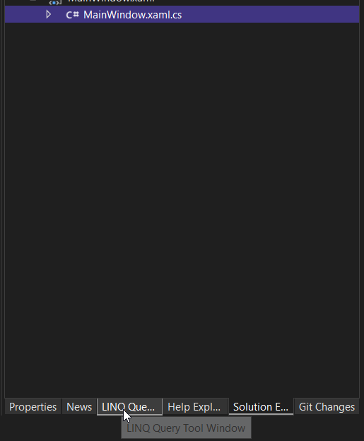

The LINQ Query Tool Window will open: 

Now click the LINQ Query Tool Window button:


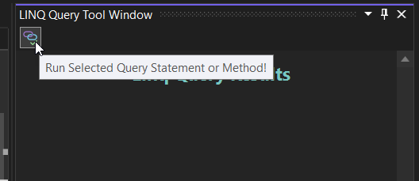


Since this query uses the "result" variable we have defined it will run with out exception and provide two results.

- Result 1: The result of the query:

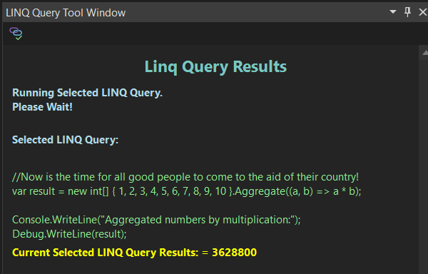

- Result 2: A new temp Editor window with a copy of our LINQ Query in full color syntax mode.

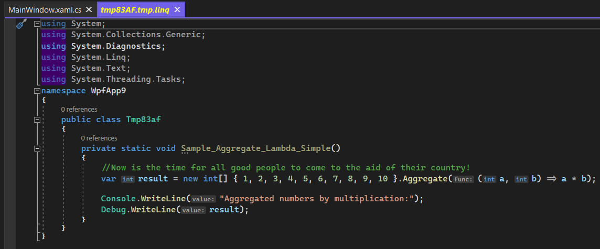

Now lets try a query that does not have "result" variable but "results" variable:

```CSharp
	static void Sample_OrderBy_Lambda_Dates()
	{
		//This works now!
		var dates = new DateTime[] {
		new DateTime(2015, 2, 15),
		new DateTime(2015, 3, 25),
		new DateTime(2015, 1, 5)
	};

		var results = dates.OrderBy(d => d);

		Debug.WriteLine("Ordered list of dates:");
		foreach (DateTime dt in results)
			Debug.WriteLine(dt.ToString("yyyy/MM/dd"));
	}
```

Again select the entire method and then the LINQ Query button:

This time we also get two results:

- An error in Red:


- A Popup Dialog that lists the available 'result' variables we can use.

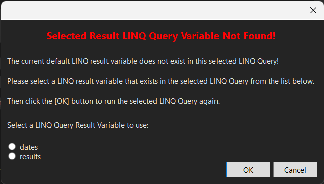

Since we can see that the "results" is the variable we want, just click the  RadioBbutton and then `OK` button.

Now we have the results we want:

- The results of the LINQ Query

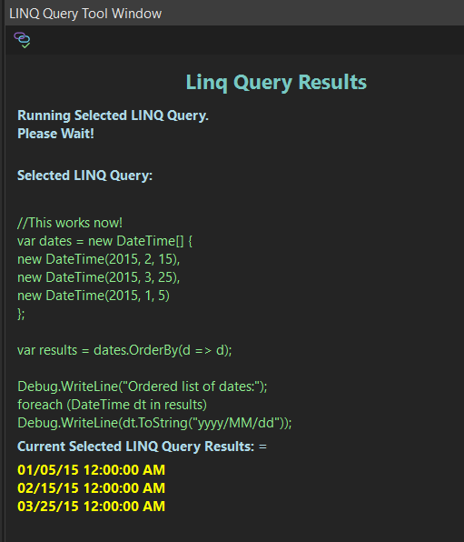

- The copy of the LINQ Query in the temp LINQ Editor Window.

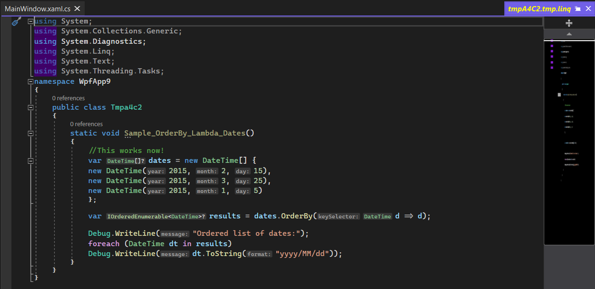

## [Change The Result Options ToolWindow Colors](#ChangResultOptionsToolWindowColors)

To change the colors of the ToolWindows text display, open the Option Page:
`Tool` `Options...` `Text Editor` `Linq` `Advanced`:


From this option page you can change colors and the default "result" variable used.


## [Download Full Source Code](#Download-Full-Source-Code)

Get the full source solution for this walkthrough from:
[LinqLanguageEditor2022](https://github.com/SFC-Sarge/LinqLanguageEditor2022)

### [Contribute to LinqLanguageEditor2022 Project](#Contribute-to-LinqLanguageEditor2022-Project)

You are invited to become a Contributor to the [LinqLanguageEditor2022](https://github.com/SFC-Sarge/LinqLanguageEditor2022) project on GitHub.
With you help we can makke it better for all developers.

Possible Changes:

- Expland current project features.
- Improve performance and threading.
- Enhance the LINQ results display in the tool window. For those LINQ Queries that are not supported yet.
- Add/Enhance Intellisense.
- Add/Enhance LightBulb features.
- Enhance Code Formatting.

### [Contribute to the VSIX Cookbook Project](#Contribute-to-the-VSIX-Cookbook-Project)

You are invited to become a Contributor to the [VSIX Cookbook](https://github.com/VsixCommunity/docs) project on GitHub.
