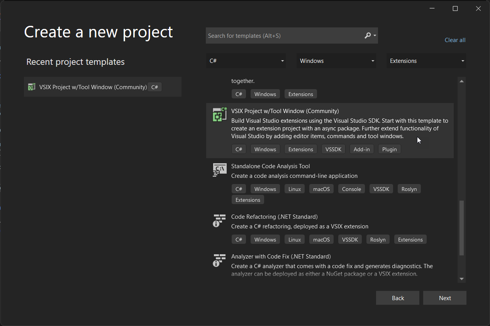
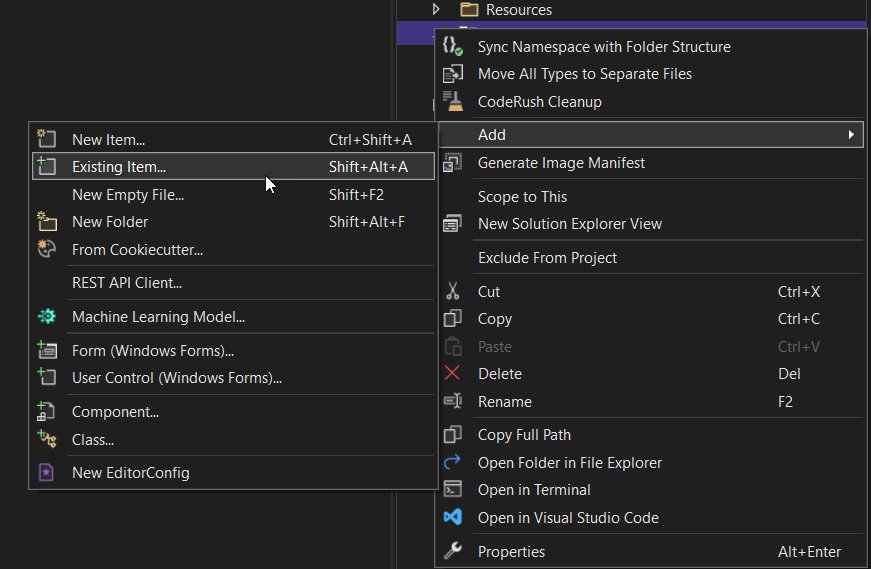
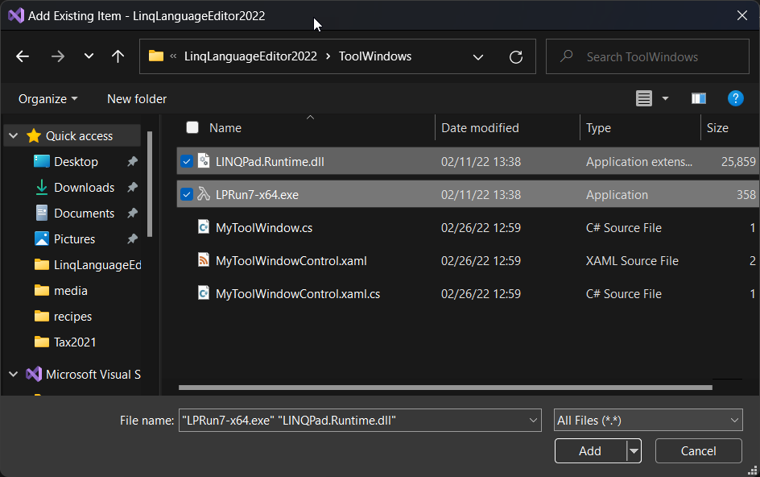
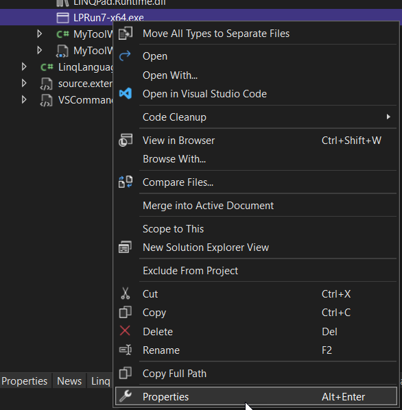
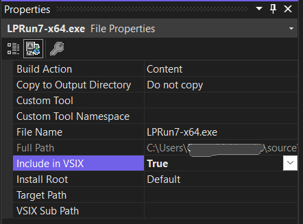

### [Walkthrough: Create Custom Language Editor](#Walkthrough-Create-Custom-Language-Editor)

The walkthrough will show you how to create a Custom Language Editor.

Walkthrough system requirements:

- [Visual Studio 2022](https://visualstudio.microsoft.com/vs/)
- [.Net 6.x](https://dotnet.microsoft.com/en-us/download/dotnet/6.0)
- [LINQPad 7](https://www.linqpad.net/Download.aspx) Free Edition or greater installed
- [VsixCommunity
Community.VisualStudio.Toolkit](https://github.com/VsixCommunity/Community.VisualStudio.Toolkit) installed

This walkthrough example, when completed, will allow you to select a LINQ query
line or Method in your C\# Project files, click a button in the `LINQ Query Tool
Window` and the selected LINQ query will be compiled and the results of the LINQ
Query will be displayed in the Custom LINQ Editor opened in either a Preview Tab
or not. Using the following code, you have the option where to display the
temporary LINQ Query. The advantage of using the
`VS.Documents.OpenInPreviewTabAsync` method, is that it is automatically removes
the previous LINQ Query each time you select and test a LINQ query. Keeping your
Visual Studio document tab space cleaner.


```csharp
if (LinqAdvancedOptions.Instance.OpenInVSPreviewTab == true)
{
	await VS.Documents.OpenInPreviewTabAsync(tempQueryPath);
}
else
{
	await VS.Documents.OpenAsync(tempQueryPath);
}
```


The Editor features are:

-   C\# Code Syntax Colorzation Support (Note: Our use of .linq files are C\#
	syntax and formatted files with .linq file extension.)

-   IntelliSense Support

-   ToolWindow Support

	-   Toolbar in ToolWindow

		-   Toolbar buttons in ToolWindow

		-   ToolWindow Messenger Support

-   Select LINQ Queries and create new temporary tab document, display in
	document in temporary view tab, and return query results in the `LINQ Query
	Tool Window`.

	-   This example uses LINQPad’s command line tools: [LPRun7-x64.exe and
		LINQPad.Runtime.dll](https://www.linqpad.net/Download.aspx) to compile
		the LINQ query and return the results.

		-   Single line LINQ Query selection and query run result support.

		-   LINQ Query Method selection and query run result support.

		-   Native [LINQPad](https://www.linqpad.net/) file Open and query run
			result support.

-   LINQ language file extension `.linq`

-   IVsRunningDocTableEvents document events support

	-   OnBeforeDocumentWindowShow (Before `.linq` extension document is
		displayed in tabbed documents view.)

		-   OnAfterDocumentWindowHide (When `.linq` extension document is
			removed from tabbed documents view. Note `.Linq` extension documents
			are temporary documents, and are deleted when removed/hidden from
			the Visual Studio Editor.)

-   Code Formatting

-   Light Bulb Suggestions

-   Tools Options and Settings Support

## [Create Visual Studio 2022 CSharp Extension](#Create-Visual-Studio-2022-CSharp-Extension)

### [Getting Started](#Getting-Started):

In Visual Studio 2022 install if you don’t’ already have it. [VsixCommunity
Community.VisualStudio.Toolkit](https://github.com/VsixCommunity/Community.VisualStudio.Toolkit)
then create a new Visual Studio 2022 c\# Extension using the:
`VSIX Project w/Tool Window (Community) Project Template`


Create New project in Visual Studio 2022


Select the `VSIX Project w/Tool Window (Community) Project Template`





Name the new extension project LinqLanguageEditor2022


Solution Explore should look like this now:


If you do not have LinqPad 7 installed then download [LINQPad 7](https://www.linqpad.net/Download.aspx).

One you have LinqPad 7 installed, copy LPRun7.exe and LINQPad.Runtime.dll to your solutions project folder under LinqLanguageEditor2022\ToolWindows
rename LinqLanguageEditor2022\ToolWindows\LPRun7.exe to LinqLanguageEditor2022\ToolWindows\LPRun7-x64.exe.
This is done so that we know we are using the 64 bit version with Visual Studio 2022.

Add LPRun7-x64.exe and  LINQPad.Runtime.dll to the project from Solution Explorer.




Change dialog file types to All Files (*.*) then select both LinqLanguageEditor2022\ToolWindows\LPRun7.exe and LinqLanguageEditor2022\ToolWindows\LINQPad.Runtime.dll and click add.




In Solution Explorer Right-Click on LPRun7-x64.exe and Select Properties:




Change Property to Include in VSIX = True: (Note: Make sure Build Action is set to Content)



Repeat this step for LINQPad.Runtime.dll and Include in VSIX = True (Note: Make sure Build Action is set to Content).


Add NuGet Packages:

- Microsoft.CodeAnalysis
- Microsoft.CodeAnalysis.CSharp
- Microsoft.CSharp


Now would be a good time if you do not already have it installed.  [Add New File (64-bit)](https://marketplace.visualstudio.com/items?itemName=MadsKristensen.AddNewFile64) extension from the Visual Studio Marketplace


Once the [Add New File (64-bit)](https://marketplace.visualstudio.com/items?itemName=MadsKristensen.AddNewFile64) extension is install.

Right-click on the project and click: Add then: New Empty File...


Add a new C# file to the project names Constants.cs:


In the Constants.cs file change the class visibility from public to internal and add the following constants.

```csharp
internal class Constants
{
	public const string LinqLanguageName = "Linq";
	public const string LinqExt = ".linq";
	public static string[] CommentChars = new[] { "///", "//" };
	public const string LinqBaselanguageName = "CSharp";
	public const string noActiveDocument = "No Active Document View or LINQ Query Selection!\r\nPlease Select LINQ Statement in Active Document,\r\nthen try again!";
	public const string runningSelectQuery = "Running Selected LINQ Query.\r\nPlease Wait!";
	public const string resultDump = "result.Dump()";
	public const string noActiveDocumentMethod = "No Active Document View or LINQ Method Selection!\r\nPlease Select LINQ Method in Active Document,\r\nthen try again!";
	public const string currentSelectionQueryMethod = "Current Selection Query Method Results";
	public const string currentSelectionQuery = "Current Selection Query Results";
	public const string runningSelectQueryMethod = "Running Selected LINQ Query Method.\r\nPlease Wait!";
	public const string queryKindStatement = "<Query Kind='Statements' />";
	public const string queryKindMethod = "<Query Kind='Program' />";
	public const string exceptionIn = "Exception in ";
	public const string exceptionCall = "Call. ";
	public const string fileLPRun7Args = "-fx=6.0";
	public const string linpPadDump = "LinqPad Dump";
	public const string runSelectedLinqStatement = "Run Selected LINQ Statement.";
	public const string runSelectedLinqMethod = "Run Selected LINQ Method.";
	public const string runEditorLinqQuery = "Run Editor LINQ Query.";
	public const string lPRun7Executable = "LPRun7-x64.exe";
	public const string LinqEditorToolWindowTitle = "LINQ Query Tool Window";
	public const string solutionToolWindowsFolderName = "ToolWindows";
	public const string linqStatementTemplate = "using System;\r\nusing System.Collections.Generic;\r\nusing System.Diagnostics;\r\nusing System.Linq;\r\nusing System.Text;\r\nusing System.Threading.Tasks;\r\nnamespace {namespace}\r\n{\r\n\tpublic class {itemname}\r\n\t{\r\n\t\tpublic static void {methodname}()\r\n\t\t{\r\n\t\t\t{$}\r\n\t\t}\r\n\t}\r\n}";
	public const string linqMethodTemplate = "using System;\r\nusing System.Collections.Generic;\r\nusing System.Diagnostics;\r\nusing System.Linq;\r\nusing System.Text;\r\nusing System.Threading.Tasks;\r\nnamespace {namespace}\r\n{\r\n\tpublic class {itemname}\r\n\t{\r\n\t\t{$}\r\n\t}\r\n}";
}
```

## [ToolWindow Features](#ToolWindow-Features)

In Solution Explorer open the ToolWindows\MyToolWindow.cs file.

Right-Click on the Class name `MyToolWindow` then click Rename


Rename it to `LinqToolWindow` and make sure you check:

- Include comments
- Include strings
- Rename symbol's file
- Preview changes

Click Apply:


Then Click Apply in `Preview Changes-Rename`:


In Solution Explorer Right-Click `MyToolWindowControl.xaml` file and click Rename:

Rename the file to `LinqToolWindowControl.xaml` and hit enter key.

In Solution Explorer Right-Click `MyToolWindowCommand.cs` file and click Rename:
Rename the file to `LinqToolWindowCommand.cs` and hit enter key.

Click Yes to the pop-up Dialog:


Solution Explorer should now look like this:


At this point the project will build without issues.


## [Update Package file](#Update-Package-file)

Open the package file `LinqLanguageEditor2022Package.cs`.

Add `ProvideToolWindowVisibility` attribute lines under the `ProvideToolWindow` attribute:

```CSharp
[ProvideToolWindowVisibility(typeof(LinqToolWindow.Pane), VSConstants.UICONTEXT.SolutionHasSingleProject_string)]
[ProvideToolWindowVisibility(typeof(LinqToolWindow.Pane), VSConstants.UICONTEXT.SolutionHasMultipleProjects_string)]
[ProvideToolWindowVisibility(typeof(LinqToolWindow.Pane), VSConstants.UICONTEXT.NoSolution_string)]
[ProvideToolWindowVisibility(typeof(LinqToolWindow.Pane), VSConstants.UICONTEXT.EmptySolution_string)]
```

So the Package file attributes should look like this now:

```CSharp
[PackageRegistration(UseManagedResourcesOnly = true, AllowsBackgroundLoading = true)]
[InstalledProductRegistration(Vsix.Name, Vsix.Description, Vsix.Version)]
[ProvideToolWindow(typeof(LinqToolWindow.Pane), Style = VsDockStyle.Tabbed, Window = WindowGuids.SolutionExplorer)]
[ProvideToolWindowVisibility(typeof(LinqToolWindow.Pane), VSConstants.UICONTEXT.SolutionHasSingleProject_string)]
[ProvideToolWindowVisibility(typeof(LinqToolWindow.Pane), VSConstants.UICONTEXT.SolutionHasMultipleProjects_string)]
[ProvideToolWindowVisibility(typeof(LinqToolWindow.Pane), VSConstants.UICONTEXT.NoSolution_string)]
[ProvideToolWindowVisibility(typeof(LinqToolWindow.Pane), VSConstants.UICONTEXT.EmptySolution_string)]
[ProvideMenuResource("Menus.ctmenu", 1)]
[Guid(PackageGuids.LinqLanguageEditor2022String)]
```

Add a `ProvideFileIcon` attribute after the last ProvideToolWindowVisibility attribute:

```CSharp
[ProvideFileIcon(Constants.LinqExt, "KnownMonikers.RegistrationScript")]
```

We now have the File Icon set to our `Constants.LinqExt` (.linq) and an Icon image using the `KnownMonikers.RegistrationScript`

At this point the project should still build without issues.

## [Create LINQ Editor Factory](#Create-LINQ-Editor-Factory)

In Solution Explorer right-click the project and click `Add` then `New Empty File...`

In the Add New File (64-bit) dialog enter `LinqEditor\LinqLanguageFactory.cs` then click `Add file`.


In Solution Explorer open `VSCommandTable.vsct` file: (Note: This is an xml file.)

In the `<Symbols>` section above the first `<GuidSymbol>` section add the line below then update to Guid `{0CA07535-1A01-485D-9E65-59B7384A593C}` to a new Guid value.

```xml
<GuidSymbol name="LinqEditorFactory" value="{0CA07535-1A01-485D-9E65-59B7384A593C}" />
```

So from this:

```xml
<Symbols>
<GuidSymbol name="LinqLanguageEditor2022" value="{fbcd0cc8-7332-4a38-ad18-4d271e337600}">
	<IDSymbol name="MyCommand" value="0x0100" />
</GuidSymbol>
</Symbols>
```

To this:

```xml
<Symbols>
	<GuidSymbol name="LinqEditorFactory" value="{0CA07535-1A01-485D-9E65-59B7384A593C}" />
	<GuidSymbol name="LinqLanguageEditor2022" value="{fbcd0cc8-7332-4a38-ad18-4d271e337600}">
	<IDSymbol name="MyCommand" value="0x0100" />
</GuidSymbol>
</Symbols>
```

Now rename the `MyCommand` name in two places iside of `VSCommandTable.vsct` file.

Rename `MyCommand` to `LinqCommand`.

Rename `<ButtonText>My Tool Window</ButtonText>` to `<ButtonText>LINQ Query Tool Window</ButtonText>`

Save the `VSCommandTable.vsct` file.

Now when we build we get our first build error:

> Error	CS0117	'PackageIds' does not contain a definition for 'MyCommand'	LinqLanguageEditor2022

To fix this double click the error in the Error List window. It will open LinqToolWindowCommand.cs file.

Rename `[Command(PackageIds.MyCommand)]` to `[Command(PackageIds.LinqCommand)]` and save the file.

Should build without issues now.

## [Add Toolbar and Buttons to ToolWindow](#Add-Toolbar-and-Buttons-to-ToolWindow)

In the `VSCommandTable.vsct` file under the `<Symbols>` section Add below the `LinqCommand` line:

```xml
<IDSymbol name="LinqTWindowToolbar" value="0x1000" />
<IDSymbol name="LinqTWindowToolbarGroup" value="0x1050" />
```

It should look like this now:

```xml
<Symbols>
	<GuidSymbol name="LinqEditorFactory" value="{0CA07535-1A01-485D-9E65-59B7384A593C}" />
	<GuidSymbol name="LinqLanguageEditor2022" value="{fbcd0cc8-7332-4a38-ad18-4d271e337600}">
		<IDSymbol name="LinqCommand" value="0x0100" />
		<IDSymbol name="LinqTWindowToolbar" value="0x1000" />
		<IDSymbol name="LinqTWindowToolbarGroup" value="0x1050" />
	</GuidSymbol>
</Symbols>
```


Solution should build without issues.

Open the package file `LinqLanguageEditor2022Package.cs`.

Add a using statement:

```CSharp
using LinqLanguageEditor2022.LinqEditor;
```

Add the `ProvideLanguageService` attribute line:

```CSharp
[ProvideLanguageService(typeof(LinqLanguageFactory), Constants.LinqLanguageName, 0, ShowHotURLs = false, DefaultToNonHotURLs = true, EnableLineNumbers = true, EnableAsyncCompletion = true, EnableCommenting = true, ShowCompletion = true, AutoOutlining = true, CodeSense = true)]
```

Should look like this now:

```CSharp
[PackageRegistration(UseManagedResourcesOnly = true, AllowsBackgroundLoading = true)]
[InstalledProductRegistration(Vsix.Name, Vsix.Description, Vsix.Version)]
[ProvideToolWindow(typeof(LinqToolWindow.Pane), Style = VsDockStyle.Tabbed, Window = WindowGuids.SolutionExplorer)]
[ProvideToolWindowVisibility(typeof(LinqToolWindow.Pane), VSConstants.UICONTEXT.SolutionHasSingleProject_string)]
[ProvideToolWindowVisibility(typeof(LinqToolWindow.Pane), VSConstants.UICONTEXT.SolutionHasMultipleProjects_string)]
[ProvideToolWindowVisibility(typeof(LinqToolWindow.Pane), VSConstants.UICONTEXT.NoSolution_string)]
[ProvideToolWindowVisibility(typeof(LinqToolWindow.Pane), VSConstants.UICONTEXT.EmptySolution_string)]
[ProvideFileIcon(Constants.LinqExt, "KnownMonikers.RegistrationScript")]
[ProvideMenuResource("Menus.ctmenu", 1)]
[Guid(PackageGuids.LinqLanguageEditor2022String)]

[ProvideLanguageService(typeof(LinqLanguageFactory), Constants.LinqLanguageName, 0, ShowHotURLs = false, DefaultToNonHotURLs = true, EnableLineNumbers = true, EnableAsyncCompletion = true, EnableCommenting = true, ShowCompletion = true, AutoOutlining = true, CodeSense = true)]
```


Edit the `LinqLanguageFactory.cs` class and change the class visibility to internal and add the following code:

Add using statment:

```CSharp
using System.ComponentModel.Composition;
```

Update Class code to:

```CSharp
[ComVisible(true)]
[Guid(PackageGuids.LinqEditorFactoryString)]
internal sealed class LinqLanguageFactory : LanguageBase
{
	[Export]
	[Name(Constants.LinqLanguageName)]
	[BaseDefinition("code")]
	[BaseDefinition("Intellisense")]
	[BaseDefinition(Constants.LinqBaselanguageName)]
	internal static ContentTypeDefinition LinqContentTypeDefinition { get; set; }

	[Import]
	internal IEditorOptionsFactoryService EditorOptions { get; set; }

	[Export]
	[FileExtension(Constants.LinqExt)]
	[ContentType(Constants.LinqLanguageName)]
	[BaseDefinition("code")]
	[BaseDefinition("Intellisense")]
	[BaseDefinition(Constants.LinqBaselanguageName)]
	internal static FileExtensionToContentTypeDefinition LinqFileExtensionDefinition { get; set; }

	[Export]
	[Name(Constants.LinqLanguageName)]
	[BaseDefinition(Constants.LinqBaselanguageName)]
	internal static ClassificationTypeDefinition LinqDefinition { get; set; }

	public LinqLanguageFactory(object site) : base(site)
	{ }

	public override string Name => Constants.LinqLanguageName;

	public override string[] FileExtensions { get; } = new[] { Constants.LinqExt };


	public override void SetDefaultPreferences(LanguagePreferences preferences)
	{
		preferences.EnableCodeSense = true;
		preferences.EnableMatchBraces = true;
		preferences.EnableMatchBracesAtCaret = true;
		preferences.EnableShowMatchingBrace = true;
		preferences.EnableCommenting = true;
		preferences.HighlightMatchingBraceFlags = _HighlightMatchingBraceFlags.HMB_USERECTANGLEBRACES;
		preferences.LineNumbers = true;
		preferences.MaxErrorMessages = 100;
		preferences.AutoOutlining = true;
		preferences.MaxRegionTime = 2000;
		preferences.InsertTabs = true;
		preferences.IndentSize = 2;
		preferences.IndentStyle = IndentingStyle.Smart;
		preferences.ShowNavigationBar = true;
		preferences.EnableFormatSelection = true;

		preferences.WordWrap = true;
		preferences.WordWrapGlyphs = true;

		preferences.AutoListMembers = true;
		preferences.HideAdvancedMembers = false;
		preferences.EnableQuickInfo = true;
		preferences.ParameterInformation = true;
	}

	public override void Dispose()
	{
		base.Dispose();
	}
}
```

## [Register the Language Factory](#Register-the-Language-Factory)

In the `LinqLanguageEditor2022Package.cs` file, under the Task InitializeAsync method of the LinqLanguageEditor2022Package Class, Register the Language Factory by add this code:

```CSharp
LinqLanguageFactory LinqLanguageEditor2022 = new(this);
RegisterEditorFactory(LinqLanguageEditor2022);
```

The LinqlanguageEditor2022Package Class should look like this now:

```CSharp
public sealed class LinqLanguageEditor2022Package : ToolkitPackage
{
	protected override async Task InitializeAsync(CancellationToken cancellationToken, IProgress<ServiceProgressData> progress)
	{
		LinqLanguageFactory LinqLanguageEditor2022 = new(this);
		RegisterEditorFactory(LinqLanguageEditor2022);
		await this.RegisterCommandsAsync();

		this.RegisterToolWindows();
	}
}
```

Solution should build without issues.


## [Add Messenger Service to Package to handle ToolWindow Toolbar button Commands](#Add-Messenger-Service-to-Package-to-handle-commands)

In Solution Explorer right-click the project and click `Add` then `New Empty File...`

Name the file: `LinqToolWindowMessenger.cs`

Update the LinqToolWindowMessenger Class as follows:

```CSharp
public class LinqToolWindowMessenger
{
	public void Send(string message)
	{
		// The tooolbar button will call this method.
		// The tool window has added an event handler
		MessageReceived?.Invoke(this, message);
	}

	public event EventHandler<string> MessageReceived;

}
```

In the `LinqLanguageEditor2022Package.cs` file, under the Task InitializeAsync method of the LinqLanguageEditor2022Package Class, Register the Language Factory by add this code:

add this code:

```CSharp
AddService(typeof(LinqToolWindowMessenger), (_, _, _) => Task.FromResult<object>(new LinqToolWindowMessenger()));
((IServiceContainer)this).AddService(typeof(LinqLanguageFactory), LinqLanguageEditor2022, true);
```

Then Add these attributes:

```CSharp
[ProvideLanguageExtension(typeof(LinqLanguageFactory), Constants.LinqExt)]
[ProvideEditorFactory(typeof(LinqLanguageFactory), 740, CommonPhysicalViewAttributes = (int)__VSPHYSICALVIEWATTRIBUTES.PVA_SupportsPreview, TrustLevel = __VSEDITORTRUSTLEVEL.ETL_AlwaysTrusted)]
[ProvideEditorExtension(typeof(LinqLanguageFactory), Constants.LinqExt, 65536, NameResourceID = 740)]
[ProvideEditorLogicalView(typeof(LinqLanguageFactory), VSConstants.LOGVIEWID.TextView_string, IsTrusted = true)]
```

Save the `LinqLanguageEditor2022Package.cs`.

Solution should build without issues.

In the `LinqToolWindow.cs` file add the Toolbar to the ToolWindow Pane.

Update the public Pane() constructor:

```CSharp
ToolBar = new CommandID(PackageGuids.LinqLanguageEditor2022, PackageIds.LinqTWindowToolbar);
```
Should look like this:

```CSharp
public Pane()
{
	BitmapImageMoniker = KnownMonikers.ToolWindow;
	ToolBar = new CommandID(PackageGuids.LinqLanguageEditor2022, PackageIds.LinqTWindowToolbar);

}
```

Change the LinqToolWindow GetTitle method as follows to rename the Tool Windows Title:

from:
```CSharp
public override string GetTitle(int toolWindowId) => "My Tool Window";
```

To this:
```CSharp
public override string GetTitle(int toolWindowId) => Constants.LinqEditorToolWindowTitle;
```

## [Toolbar Buttons to ToolWindow Toolbar](#Toolbar-Buttons-to-ToolWindow-Toolbar)

In the `VSCommandTable.vsct` file under the `<Symbols>` section Add below the `LinqTWindowToolbarGroup` line:

```xml
<IDSymbol name="DisplayLinqPadStatementsResults" value="0x0111" />
<IDSymbol name="DisplayLinqPadMethodResults" value="0x0112" />
<IDSymbol name="LinqEditorLinqPad" value="0x0114" />
<IDSymbol name="LinqEditorGroup" value="0x0001"/>
```

Now add the buttons in the `<buttons>` section add the following buttons:

```xml
<Button guid="LinqLanguageEditor2022" id="DisplayLinqPadStatementsResults" priority="0x0001" type="Button">
<Parent guid="LinqLanguageEditor2022" id="LinqTWindowToolbarGroup"/>
<Icon guid="ImageCatalogGuid" id="Linq"/>
<CommandFlag>IconIsMoniker</CommandFlag>
<Strings>
	<ButtonText>Run Selected Query Statement!</ButtonText>
</Strings>
</Button>
<Button guid="LinqLanguageEditor2022" id="DisplayLinqPadMethodResults" priority="0x0002" type="Button">
<Parent guid="LinqLanguageEditor2022" id="LinqTWindowToolbarGroup"/>
<Icon guid="ImageCatalogGuid" id="LinkValidator"/>
<CommandFlag>IconIsMoniker</CommandFlag>
<Strings>
	<ButtonText>Run Selected Query Method!</ButtonText>
</Strings>
</Button>
<Button guid="LinqLanguageEditor2022" id="LinqEditorLinqPad" priority="0x0003" type="Button">
<Parent guid="LinqLanguageEditor2022" id="LinqTWindowToolbarGroup"/>
<Icon guid="ImageCatalogGuid" id="Editor"/>
<CommandFlag>IconIsMoniker</CommandFlag>
<Strings>
	<ButtonText>Run Editor Linq Query!</ButtonText>
</Strings>
</Button>
```


Open the Designer for `LinqToolWindowControl.xaml` file:

Replace the existing Grid and it contents with this:

Replace this:

```xml
<Grid>
	<StackPanel Orientation="Vertical">
		<Label x:Name="lblHeadline"
				Margin="10"
				HorizontalAlignment="Center">Title</Label>
		<Button Content="Click me!"
				Click="button1_Click"
				Width="120"
				Height="80"
				Name="button1" />
	</StackPanel>
</Grid>
```

With This:

```xml
<Grid>
	<Grid.ColumnDefinitions>
		<ColumnDefinition Width="*" />
	</Grid.ColumnDefinitions>
	<ScrollViewer Grid.Column="0" HorizontalScrollBarVisibility="Auto">
		<StackPanel Orientation="Vertical">
			<TextBlock Margin="10 10 0 0" HorizontalAlignment="Center" Text="Linq Query Results"></TextBlock>
			<StackPanel Margin="10 10 0 0" Name="LinqPadResults" Orientation="Vertical" HorizontalAlignment="Left" MaxWidth="400" />
		</StackPanel>
	</ScrollViewer>
</Grid>
```

Save the `LinqToolWindowControl.xaml` file


## [Download Full Source Code](#Download-Full-Source-Code)

Get the full source solution for this walkthrough from:
[LinqLanguageEditor2022](https://github.com/SFC-Sarge/LinqLanguageEditor2022)

### [Contribute to LinqLanguageEditor2022 Project](#Contribute-to-LinqLanguageEditor2022-Project)

You are invited to become a Contributor to the [LinqLanguageEditor2022](https://github.com/SFC-Sarge/LinqLanguageEditor2022) project on GitHub.
With you help we can makke it better for all developers.

Possible Changes:

- Replace external dependancy on LINQPad to Compile and return LINQ results with Rosyln, etc.
- Expland current project features.
- Improve performance and threading.
- Enhance the LINQ results display in the tool window.

### [Contribute to the VSIX Cookbook Project](#Contribute-to-the-VSIX-Cookbook-Project)

You are invited to become a Contributor to the [VSIX Cookbook](https://github.com/VsixCommunity/docs) project on GitHub.
